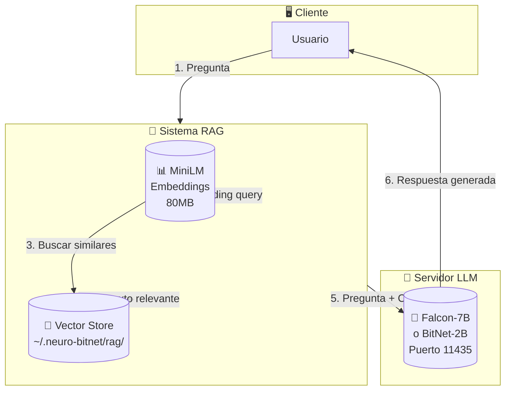
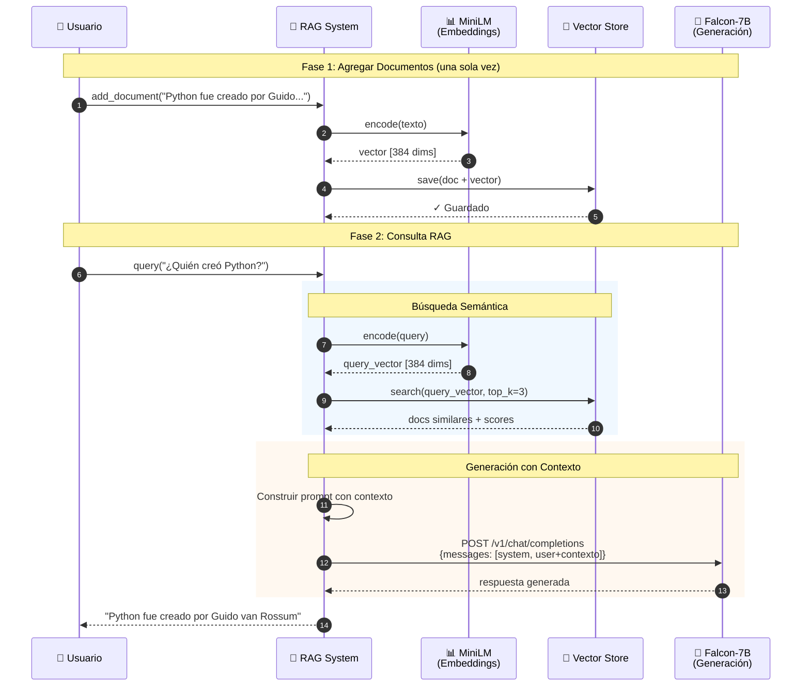

# neuro-bitnet

[](https://hub.docker.com/r/madkoding/neuro-bitnet)
[](https://hub.docker.com/r/madkoding/neuro-bitnet)
[](https://github.com/madkoding/neuro-bitnet/actions)

Docker container para modelos **BitNet 1.58-bit** con soporte GPU, API compatible con OpenAI y sistema **RAG** integrado.

## 📦 Modelos Disponibles

### Modelos de Generación (LLM)

| Modelo | Tag Docker | Tamaño | VRAM | Calidad | Velocidad |
|--------|------------|--------|------|---------|----------|
| **Falcon3-7B-Instruct** | `falcon-7b` (default) | ~5 GB | ~2 GB | ⭐⭐⭐⭐ | Moderada |
| **BitNet-b1.58-2B-4T** | `bitnet-2b` | ~4 GB | ~800 MB | ⭐⭐⭐ | ⚡⚡⚡ Rápida |

### Modelos de Embeddings (RAG)

| Modelo | Tamaño | RAM | Calidad | Uso recomendado |
|--------|--------|-----|---------|-----------------|
| **all-MiniLM-L6-v2** | 80MB | ~200MB | Buena | FAQs, chatbots básicos |
| **all-mpnet-base-v2** | 420MB | ~500MB | Muy buena | Documentación técnica |
| **e5-large-v2** | 1.2GB | ~1.5GB | Excelente | Búsqueda semántica avanzada |
| **bge-large-en-v1.5** | 1.3GB | ~1.5GB | Excelente | Producción enterprise |

## 🏗️ Arquitectura

El sistema usa **dos modelos separados** que trabajan en conjunto:



### Diagrama de Secuencia Detallado



### Flujo de APIs

```mermaid
flowchart LR
    subgraph Input["📥 Entrada"]
        Q[Pregunta del usuario]
    end
    
    subgraph Embeddings["📊 sentence-transformers"]
        direction TB
        E1["all-MiniLM-L6-v2"]
        E2["all-mpnet-base-v2"]
        E3["e5-large-v2"]
        E4["bge-large-en-v1.5"]
    end
    
    subgraph Storage["💾 Almacenamiento"]
        direction TB
        JSON["documents.json"]
        NPY["embeddings.npy"]
    end
    
    subgraph LLM["🦅 llama-server:11435"]
        direction TB
        EP1["/v1/chat/completions"]
        EP2["/v1/completions"]
        EP3["/health"]
    end
    
    subgraph Output["📤 Salida"]
        R[Respuesta enriquecida]
    end
    
    Q --> Embeddings
    Embeddings --> Storage
    Storage --> LLM
    LLM --> Output
```



## 🚀 Inicio Rápido

```bash
# Opción 1: Falcon-7B (buen balance calidad/velocidad, default)
docker pull madkoding/neuro-bitnet:falcon-7b
docker compose up -d

# Opción 2: BitNet-2B (más rápido, menos recursos)
BITNET_MODEL=bitnet-2b docker compose up -d

# Verificar que está funcionando
curl http://localhost:11435/health
```

### Seleccionar Modelo

```bash
# En .env
BITNET_MODEL=falcon-7b    # Falcon 7B (default)
BITNET_MODEL=bitnet-2b    # BitNet 2B (ligero)

# O directamente en el comando
BITNET_MODEL=bitnet-2b docker compose up -d
```

### Build Local (opcional)

Si prefieres construir la imagen localmente:

```bash
# Editar docker-compose.yml, descomentar la sección build
# Luego:
docker compose build
docker compose up -d
```

## 🧪 Tests y Benchmarks

El proyecto incluye un suite completo de pruebas:

```bash
# Ejecutar benchmark rápido (tabla comparativa)
python3 tests/quick_bench.py

# Ejecutar benchmark completo (22 tests)
python3 tests/benchmark.py

# Ejecutar stress test (rendimiento)
python3 tests/stress_test.py

# Usar el runner interactivo
./tests/run_tests.sh
```

### Resultados Típicos

| Categoría | Tests | Éxito | Notas |
|-----------|-------|-------|-------|
| 💬 Chat | 3 | 100% | Respuestas conversacionales |
| 💻 Código | 5 | 100% | Python, SQL, clases |
| 🔧 Tools | 5 | 60-80% | Simulación prompt-based |
| 🧠 Razonamiento | 3 | 66% | Lógica y secuencias |
| 🔢 Matemáticas | 3 | 66% | Operaciones básicas |
| 🇪🇸 Español | 3 | 100% | Traducción y código |

> **Nota**: Resultados con modelo Falcon-7B. BitNet-2B puede variar.

### Rendimiento

- **Tokens/segundo**: ~35-40 t/s (CPU AVX512)
- **Latencia promedio**: ~800ms por request
- **Throughput**: ~1-2 requests/segundo

## 📡 API Endpoints

El servidor expone una API **100% compatible con OpenAI**:

| Endpoint | Método | Descripción |
|----------|--------|-------------|
| `/v1/chat/completions` | POST | Chat completions (conversacional) |
| `/v1/completions` | POST | Text completions |
| `/v1/models` | GET | Listar modelos disponibles |
| `/health` | GET | Health check |
| `/metrics` | GET | Métricas Prometheus |

### Ejemplo: Chat Completion

```bash
curl http://localhost:11435/v1/chat/completions \
  -H "Content-Type: application/json" \
  -d '{
    "model": "bitnet",
    "messages": [
      {"role": "system", "content": "Eres un asistente útil."},
      {"role": "user", "content": "Escribe una función en Python que calcule fibonacci."}
    ],
    "temperature": 0.7,
    "max_tokens": 512
  }'
```

### Ejemplo: Completion Simple

```bash
curl http://localhost:11435/v1/completions \
  -H "Content-Type: application/json" \
  -d '{
    "prompt": "def fibonacci(n):",
    "max_tokens": 200,
    "temperature": 0.3
  }'
```


## 🔍 Sistema RAG (Retrieval-Augmented Generation)

El sistema RAG permite enriquecer las respuestas del modelo con información de tus propios documentos.

### Modos de Operación

| Modo | Backend | Auto-learn | Memoria | Uso |
|------|---------|------------|---------|-----|
| **Simple** (default) | Archivos | ❌ | ❌ | Proyectos pequeños |
| **Avanzado** | SurrealDB | ✅ | ✅ | Multi-usuario, producción |

### Instalación

```bash
# Dependencias básicas
pip install sentence-transformers numpy requests

# Para modo avanzado (opcional)
pip install surrealdb
```

### Modo Simple (Default)

```bash
# Agregar documentos
python3 scripts/rag.py add "Python fue creado por Guido van Rossum"
python3 scripts/rag.py add-file documentacion.txt

# Consultar
python3 scripts/rag.py query "¿Quién creó Python?"

# Modo interactivo
python3 scripts/rag.py interactive

# Administrar
python3 scripts/rag.py list
python3 scripts/rag.py delete <doc_id>
python3 scripts/rag.py clear
```

### Modo Avanzado (Multi-usuario + Auto-learn)

```bash
# 1. Levantar SurrealDB
docker compose --profile rag up -d

# 2. Usar con auto-learn (busca en web si no tiene info)
python3 scripts/rag.py --backend surrealdb --auto-learn query "¿Qué es Kubernetes?"

# 3. Multi-usuario (cada usuario tiene su propio espacio)
python3 scripts/rag.py --user juan --backend surrealdb add "Notas de Juan"
python3 scripts/rag.py --user maria --backend surrealdb add "Notas de María"

# 4. Guardar conversaciones como conocimiento
python3 scripts/rag.py --save-conversations interactive
```

### Aprendizaje desde la Web

```bash
# Aprender sobre un tema (busca en Wikipedia + DuckDuckGo)
python3 scripts/rag.py learn "Elon Musk"
python3 scripts/rag.py learn "Machine Learning"

# Con auto-learn, lo hace automáticamente si no tiene info
python3 scripts/rag.py --auto-learn query "¿Quién fundó SpaceX?"
```

### Modelos de Embeddings

```bash
# MiniLM (default, 80MB, rápido)
python3 scripts/rag.py -e minilm query "..."

# MPNet (420MB, mejor calidad)
python3 scripts/rag.py -e mpnet query "..."

# E5 Large (1.2GB, excelente para búsqueda)
python3 scripts/rag.py -e e5 query "..."

# BGE Large (1.3GB, multiidioma)
python3 scripts/rag.py -e bge query "..."
```

### Almacenamiento

**Modo Simple (archivos):**
```
~/.neuro-bitnet/rag/<user_id>/
├── documents.json    # Textos
└── embeddings.npy    # Vectores
```

**Modo Avanzado (SurrealDB):**
- Base de datos: `neurobitnet.rag`
- Índices vectoriales MTREE para búsqueda eficiente
- Escalable a millones de documentos

### Variables de Entorno RAG

| Variable | Default | Descripción |
|----------|---------|-------------|
| `RAG_LLM_URL` | `http://localhost:11435` | URL del LLM |
| `RAG_SURREALDB_URL` | `ws://localhost:8000/rpc` | URL de SurrealDB |
| `RAG_SURREALDB_USER` | `root` | Usuario SurrealDB |
| `RAG_SURREALDB_PASS` | `root` | Password SurrealDB |


### Variables de Entorno

| Variable | Default | Descripción |
|----------|---------|-------------|
| `BITNET_EXTERNAL_PORT` | `11435` | Puerto externo del servidor |
| `BITNET_CTX_SIZE` | `4096` | Tamaño de contexto (tokens) |
| `BITNET_PARALLEL` | `4` | Slots para requests paralelos |
| `BITNET_GPU_LAYERS` | `99` | Capas en GPU (0=solo CPU) |
| `BITNET_THREADS` | `4` | Threads CPU |
| `CUDA_VISIBLE_DEVICES` | `0` | GPU a utilizar |
| `HF_TOKEN` | - | Token HuggingFace (opcional) |

### Distribución de Contexto Recomendada (4096 tokens)

```
┌─────────────────────────────────────────────────────────────┐
│ System Prompt                                    ~500 tokens│
├─────────────────────────────────────────────────────────────┤
│ Tool/MCP Definitions                             ~800 tokens│
├─────────────────────────────────────────────────────────────┤
│ RAG Chunks (documentos relevantes)              ~1200 tokens│
├─────────────────────────────────────────────────────────────┤
│ Historial de Conversación / Memoria             ~1000 tokens│
├─────────────────────────────────────────────────────────────┤
│ Query + Espacio para Respuesta                   ~596 tokens│
└─────────────────────────────────────────────────────────────┘
```

## 🎮 Requisitos GPU

### Prerequisitos

1. **NVIDIA Driver** ≥ 525.60.13
2. **CUDA** ≥ 12.1
3. **nvidia-container-toolkit**

```bash
# Instalar nvidia-container-toolkit (Ubuntu/Debian)
curl -fsSL https://nvidia.github.io/libnvidia-container/gpgkey | sudo gpg --dearmor -o /usr/share/keyrings/nvidia-container-toolkit-keyring.gpg
curl -s -L https://nvidia.github.io/libnvidia-container/stable/deb/nvidia-container-toolkit.list | \
  sed 's#deb https://#deb [signed-by=/usr/share/keyrings/nvidia-container-toolkit-keyring.gpg] https://#g' | \
  sudo tee /etc/apt/sources.list.d/nvidia-container-toolkit.list
sudo apt-get update
sudo apt-get install -y nvidia-container-toolkit
sudo nvidia-ctk runtime configure --runtime=docker
sudo systemctl restart docker

# Verificar
docker run --rm --gpus all nvidia/cuda:12.1-base-ubuntu22.04 nvidia-smi
```

### VRAM Estimada

| Modelo | VRAM Base | + 4 slots × 4096 ctx | Total |
|--------|-----------|---------------------|-------|
| **Falcon-7B** | ~1.5 GB | ~1 GB | **~2.5 GB** |
| **BitNet-2B** | ~800 MB | ~400 MB | **~1.2 GB** |

Para GPUs con menos VRAM:
```bash
# En .env
BITNET_PARALLEL=2
BITNET_CTX_SIZE=2048
# O usar bitnet-2b que requiere menos recursos
BITNET_MODEL=bitnet-2b
```

## 🔄 Migración desde Ollama

Si vienes de neuro-ollama, los cambios son mínimos:

| Aspecto | Ollama | neuro-bitnet |
|---------|--------|--------------|
| Puerto | `11434` | `11435` |
| API | OpenAI compatible | OpenAI compatible |
| Endpoint chat | `/api/chat` | `/v1/chat/completions` |
| Keep alive | Configurable | Siempre activo |
| Modelo | `ollama pull model` | Pre-incluido en imagen |

### Cambios en tu código

```python
# Antes (Ollama)
client = OpenAI(base_url="http://localhost:11434/v1")

# Después (BitNet)
client = OpenAI(base_url="http://localhost:11435/v1")
```

## ⚠️ Limitaciones

1. **Function Calling**: Los modelos BitNet 1.58-bit **no tienen soporte nativo** para function calling/tools. El servidor usa modo genérico que es menos confiable.

2. **Idioma**: Principalmente entrenados en inglés. Otros idiomas pueden tener calidad reducida.

3. **GPU Experimental**: El soporte GPU en bitnet.cpp es experimental. Si tienes problemas, usa `BITNET_GPU_LAYERS=0` para modo CPU.

4. **Contexto Largo**: Los modelos fueron entrenados con 4096 tokens máximo. Contextos más largos degradan calidad.

## 🐛 Troubleshooting

### El contenedor no inicia

```bash
# Ver logs detallados
docker-compose logs -f bitnet

# Verificar GPU
docker run --rm --gpus all nvidia/cuda:12.1-base-ubuntu22.04 nvidia-smi
```

### Error de VRAM

```bash
# Reducir uso de VRAM en .env
BITNET_PARALLEL=1
BITNET_CTX_SIZE=2048
BITNET_GPU_LAYERS=0  # Modo CPU
```

### Modelo no se descarga

```bash
# Los modelos ya vienen pre-incluidos en las imágenes de Docker Hub
# Si usas build local y falla:
docker compose logs bitnet | tail -50
```

### Healthcheck falla

```bash
# El modelo tarda ~2-3 min en cargar. Esperar y verificar:
curl http://localhost:11435/health

# Si persiste, revisar logs:
docker-compose logs bitnet | tail -50
```

## 📊 Monitoreo

Métricas Prometheus disponibles en `/metrics`:

```bash
curl http://localhost:11435/metrics
```

Métricas incluidas:
- `llamacpp_requests_total` - Total de requests
- `llamacpp_tokens_generated` - Tokens generados
- `llamacpp_prompt_tokens` - Tokens de prompt procesados
- `llamacpp_kv_cache_usage` - Uso de KV cache

## 📝 Licencia

Este proyecto usa:
- **BitNet** (Microsoft) - MIT License
- **llama.cpp** - MIT License
- **Falcon3** (TII UAE) - Falcon License

## 🔗 Referencias

- [microsoft/BitNet](https://github.com/microsoft/BitNet)
- [BitNet-b1.58-2B-4T en HuggingFace](https://huggingface.co/microsoft/BitNet-b1.58-2B-4T)
- [Falcon3-7B-Instruct-1.58bit-GGUF en HuggingFace](https://huggingface.co/tiiuae/Falcon3-7B-Instruct-1.58bit-GGUF)
- [llama.cpp Server API](https://github.com/ggerganov/llama.cpp/blob/master/examples/server/README.md)
- [Docker Hub: madkoding/neuro-bitnet](https://hub.docker.com/r/madkoding/neuro-bitnet)
