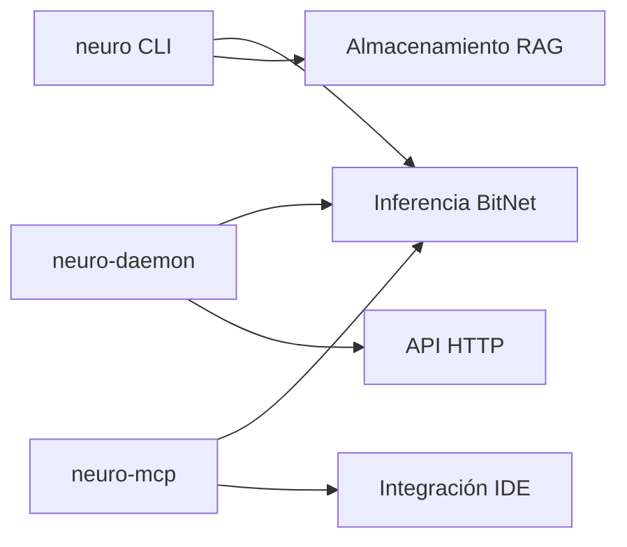

# Primeros Pasos con neuro-bitnet

Esta guía te ayudará a comenzar con neuro-bitnet, un servidor RAG de alto rendimiento con inferencia local BitNet.

## Descripción General

neuro-bitnet proporciona tres componentes principales:



| Componente | Propósito | Caso de Uso |
|-----------|---------|----------|
| `neuro` | Herramienta CLI | Scripts, consultas únicas |
| `neuro-daemon` | Servidor HTTP | Aplicaciones, integraciones |
| `neuro-mcp` | Servidor MCP | VS Code, integración IDE |

---

## Instalación

### Binarios Pre-compilados

Descarga la última versión para tu plataforma:

```bash
# Linux x86_64
curl -L https://github.com/madkoding/neuro-bitnet/releases/latest/download/neuro-linux-x86_64 -o neuro
chmod +x neuro
sudo mv neuro /usr/local/bin/

# Linux aarch64
curl -L https://github.com/madkoding/neuro-bitnet/releases/latest/download/neuro-linux-aarch64 -o neuro
chmod +x neuro
sudo mv neuro /usr/local/bin/

# macOS x86_64
curl -L https://github.com/madkoding/neuro-bitnet/releases/latest/download/neuro-darwin-x86_64 -o neuro
chmod +x neuro
sudo mv neuro /usr/local/bin/

# macOS Apple Silicon
curl -L https://github.com/madkoding/neuro-bitnet/releases/latest/download/neuro-darwin-aarch64 -o neuro
chmod +x neuro
sudo mv neuro /usr/local/bin/
```

### Cargo Install

```bash
cargo install neuro-cli
```

### Compilar desde Código Fuente

```bash
git clone https://github.com/madkoding/neuro-bitnet.git
cd neuro-bitnet
cargo build --release

# Binarios ubicados en:
# ./target/release/neuro
# ./target/release/neuro-daemon
# ./target/release/neuro-mcp
```

---

## Inicio Rápido

### 1. Configurar BitNet (para inferencia local)

```bash
# Ejecutar el script de configuración
./scripts/setup_bitnet.sh
```

Este script:
- Clona bitnet.cpp
- Compila con optimizaciones
- Instala el binario `llama-cli-bitnet`

### 2. Descargar un Modelo

```bash
neuro model download 2b
```

Modelos disponibles:

| Modelo | Tamaño | Descripción |
|-------|------|-------------|
| `2b` | 1.1 GB | BitNet b1.58 2B-4T (recomendado) |
| `large` | 0.7 GB | BitNet b1.58 Large |
| `3b` | 3.3 GB | BitNet 3B |
| `8b` | 8 GB | Llama3 8B 1.58-bit |

### 3. Hacer Preguntas

```bash
# Pregunta simple
neuro ask "¿Cuál es la capital de Francia?" --translate

# Con salida en streaming
neuro ask "Explica la computación cuántica" --stream --translate

# En español con auto-traducción para mejor precisión
neuro ask "¿Qué es la inteligencia artificial?" --translate
```

---

## Usando el CLI

### Comandos del Servidor

```bash
# Iniciar el servidor HTTP RAG
neuro serve --port 8080

# Iniciar con almacenamiento persistente
neuro serve --port 8080 --storage ./data
```

### Indexar Documentos

```bash
# Indexar un directorio
neuro index ./src --recursive --include "*.rs"

# Indexar tipos de archivo específicos
neuro index ./docs --include "*.md" --include "*.txt"

# Mostrar estadísticas de almacenamiento
neuro stats --storage ./data
```

### Consultas

```bash
# Ejecutar una consulta de búsqueda
neuro query "¿Qué es Rust?" --storage ./data

# Clasificar una consulta
neuro classify "Calcula 2 + 2"

# Buscar con contexto web
neuro search "Lenguaje de programación Rust"
```

### Inferencia

```bash
# Hacer una pregunta (inferencia local)
neuro ask "¿Qué es BitNet?" --translate

# Con salida en streaming
neuro ask "Explica la teoría de la relatividad" --stream --translate

# Con contexto de búsqueda web
neuro ask "Últimas noticias sobre Rust" --web --translate

# Con contexto RAG
neuro ask "Resume la documentación" --storage ./data --translate

# Con información de tiempo
neuro ask "¿Qué es la IA?" --timing --translate
```

### Gestión de Modelos

```bash
# Listar modelos disponibles
neuro model list

# Descargar un modelo
neuro model download 2b

# Eliminar un modelo
neuro model remove 2b

# Mostrar información del modelo
neuro model info
```

---

## Usando el Servidor Daemon

El daemon proporciona una API HTTP compatible con OpenAI para inferencia continua.

### Iniciar el Daemon

```bash
# Modo foreground (para pruebas)
neuro-daemon --foreground

# Puerto personalizado
neuro-daemon --port 8000 --foreground

# Modo background con archivo PID
neuro-daemon --pid-file /var/run/neuro-daemon.pid
```

### Probar la API

```bash
# Health check
curl http://localhost:11435/health

# Generar texto
curl -X POST http://localhost:11435/v1/generate \
  -H "Content-Type: application/json" \
  -d '{"prompt": "¿Qué es Rust?", "max_tokens": 256}'

# Completación de chat (compatible con OpenAI)
curl -X POST http://localhost:11435/v1/chat/completions \
  -H "Content-Type: application/json" \
  -d '{
    "messages": [{"role": "user", "content": "Explica la computación cuántica"}],
    "max_tokens": 512
  }'
```

### Usar con SDK de OpenAI

```python
from openai import OpenAI

client = OpenAI(
    base_url="http://localhost:11435/v1",
    api_key="no-necesario"
)

response = client.chat.completions.create(
    model="bitnet-2b",
    messages=[{"role": "user", "content": "¿Qué es Rust?"}]
)
print(response.choices[0].message.content)
```

[Ver Guía Completa del Daemon →](/neuro-bitnet/posts/daemon-server-guide-es/)

---

## Usando MCP (Integración IDE)

El servidor MCP habilita la integración con VS Code.

### Configurar VS Code

Agregar a `.vscode/settings.json`:

```json
{
  "github.copilot.chat.mcpServers": {
    "neuro-bitnet": {
      "command": "neuro-mcp",
      "args": []
    }
  }
}
```

### Herramientas Disponibles

| Herramienta | Descripción |
|------|-------------|
| `generate` | Genera texto desde un prompt |
| `translate` | Traduce texto a inglés |
| `ask` | Hace una pregunta con contexto |
| `summarize` | Resume texto |

### Uso en Copilot Chat

```
@neuro-bitnet genera una función para calcular números primos
@neuro-bitnet translate "¿Cómo implemento un árbol binario?"
@neuro-bitnet resume el código seleccionado
```

[Ver Guía Completa de MCP →](/neuro-bitnet/posts/mcp-integration-guide-es/)

---

## Arquitectura

neuro-bitnet está organizado como un workspace de Rust con 13 crates:

| Crate | Descripción |
|-------|-------------|
| `neuro-cli` | Interfaz de línea de comandos |
| `neuro-daemon` | Servidor HTTP en background |
| `neuro-mcp` | Servidor Model Context Protocol |
| `neuro-core` | Tipos compartidos y utilidades |
| `neuro-embeddings` | Embeddings basados en fastembed |
| `neuro-storage` | Almacenamiento de documentos |
| `neuro-classifier` | Clasificación de consultas |
| `neuro-search` | Integración de búsqueda web |
| `neuro-server` | Servidor HTTP API |
| `neuro-inference` | Inferencia BitNet |
| `neuro-indexer` | Indexación de código |
| `neuro-llm` | Cliente compatible con OpenAI |
| `bitnet-sys` | Bindings FFI a bitnet.cpp |

[Ver Descripción de Arquitectura →](/neuro-bitnet/posts/architecture-overview-es/)

---

## Soporte Multilingüe

Todos los componentes soportan consultas en español con auto-traducción:

```bash
# CLI con traducción
neuro ask "¿Cuál es la capital de Francia?" --translate

# El daemon auto-traduce por defecto
curl -X POST http://localhost:11435/v1/generate \
  -d '{"prompt": "¿Qué es Rust?"}'
```

La traducción mejora la precisión del **56% al 100%** para preguntas factuales en español.

[Ver Benchmark de Traducción →](/neuro-bitnet/posts/translation-benchmark-es/)

---

## Próximos Pasos

- [Guía de Inferencia Local](/neuro-bitnet/posts/local-inference-guide-es/) - Detalles de configuración de BitNet
- [Referencia de API](/neuro-bitnet/posts/api-reference-es/) - Documentación de API HTTP
- [Resultados de Benchmark](/neuro-bitnet/posts/bitnet-benchmark-results-es/) - Análisis de rendimiento
- [Guía del Servidor Daemon](/neuro-bitnet/posts/daemon-server-guide-es/) - Servidor en background
- [Guía de Integración MCP](/neuro-bitnet/posts/mcp-integration-guide-es/) - Integración IDE
