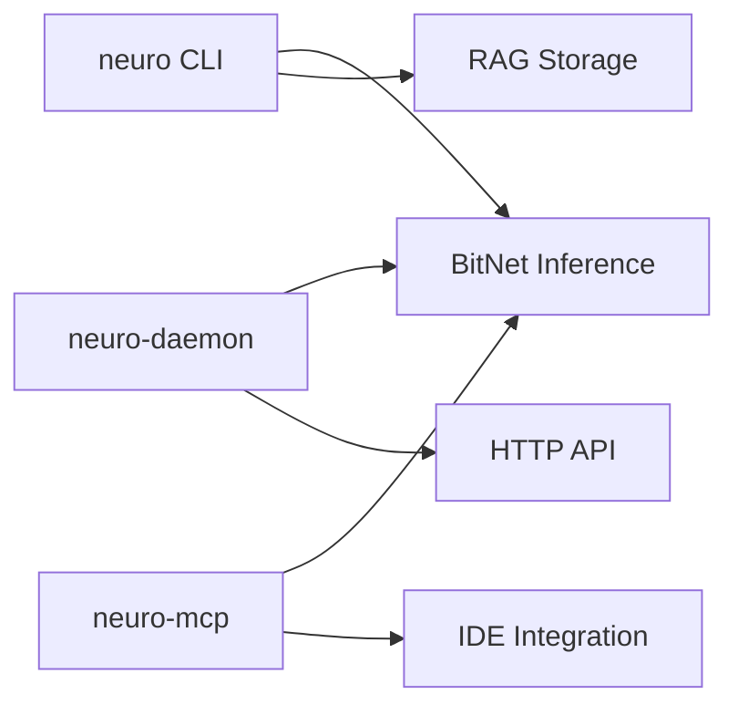

# Getting Started with neuro-bitnet

This guide will help you get started with neuro-bitnet, a high-performance RAG server with BitNet local inference.

## Overview

neuro-bitnet provides three main components:



| Component | Purpose | Use Case |
|-----------|---------|----------|
| `neuro` | CLI tool | Scripts, one-off queries |
| `neuro-daemon` | HTTP server | Applications, integrations |
| `neuro-mcp` | MCP server | VS Code, IDE integration |

---

## Installation

### Pre-built Binaries

Download the latest release for your platform:

```bash
# Linux x86_64
curl -L https://github.com/madkoding/neuro-bitnet/releases/latest/download/neuro-linux-x86_64 -o neuro
chmod +x neuro
sudo mv neuro /usr/local/bin/

# Linux aarch64
curl -L https://github.com/madkoding/neuro-bitnet/releases/latest/download/neuro-linux-aarch64 -o neuro
chmod +x neuro
sudo mv neuro /usr/local/bin/

# macOS x86_64
curl -L https://github.com/madkoding/neuro-bitnet/releases/latest/download/neuro-darwin-x86_64 -o neuro
chmod +x neuro
sudo mv neuro /usr/local/bin/

# macOS Apple Silicon
curl -L https://github.com/madkoding/neuro-bitnet/releases/latest/download/neuro-darwin-aarch64 -o neuro
chmod +x neuro
sudo mv neuro /usr/local/bin/
```

### Cargo Install

```bash
cargo install neuro-cli
```

### Build from Source

```bash
git clone https://github.com/madkoding/neuro-bitnet.git
cd neuro-bitnet
cargo build --release

# Binaries located at:
# ./target/release/neuro
# ./target/release/neuro-daemon
# ./target/release/neuro-mcp
```

---

## Quick Start

### 1. Setup BitNet (for local inference)

```bash
# Run the setup script
./scripts/setup_bitnet.sh
```

This script:
- Clones bitnet.cpp
- Compiles with optimizations
- Installs `llama-cli-bitnet` binary

### 2. Download a Model

```bash
neuro model download 2b
```

Available models:

| Model | Size | Description |
|-------|------|-------------|
| `2b` | 1.1 GB | BitNet b1.58 2B-4T (recommended) |
| `large` | 0.7 GB | BitNet b1.58 Large |
| `3b` | 3.3 GB | BitNet 3B |
| `8b` | 8 GB | Llama3 8B 1.58-bit |

### 3. Ask Questions

```bash
# Simple question
neuro ask "What is the capital of France?"

# With streaming output
neuro ask "Explain quantum computing" --stream

# In Spanish (auto-translated for better accuracy)
neuro ask "¿Cuál es la capital de Francia?" --translate
```

---

## Using the CLI

### Server Commands

```bash
# Start the RAG HTTP server
neuro serve --port 8080

# Start with persistent storage
neuro serve --port 8080 --storage ./data
```

### Indexing Documents

```bash
# Index a directory
neuro index ./src --recursive --include "*.rs"

# Index with specific file types
neuro index ./docs --include "*.md" --include "*.txt"

# Show storage statistics
neuro stats --storage ./data
```

### Queries

```bash
# Execute a search query
neuro query "What is Rust?" --storage ./data

# Classify a query
neuro classify "Calculate 2 + 2"

# Search with web context
neuro search "Rust programming language"
```

### Inference

```bash
# Ask a question (local inference)
neuro ask "What is BitNet?"

# With streaming output
neuro ask "Explain the theory of relativity" --stream

# With web search context
neuro ask "Latest news about Rust" --web

# With RAG context
neuro ask "Summarize the documentation" --storage ./data

# With timing information
neuro ask "What is AI?" --timing
```

### Model Management

```bash
# List available models
neuro model list

# Download a model
neuro model download 2b

# Remove a model
neuro model remove 2b

# Show model info
neuro model info
```

---

## Using the Daemon Server

The daemon provides an OpenAI-compatible HTTP API for continuous inference.

### Start the Daemon

```bash
# Foreground mode (for testing)
neuro-daemon --foreground

# Custom port
neuro-daemon --port 8000 --foreground

# Background mode with PID file
neuro-daemon --pid-file /var/run/neuro-daemon.pid
```

### Test the API

```bash
# Health check
curl http://localhost:11435/health

# Generate text
curl -X POST http://localhost:11435/v1/generate \
  -H "Content-Type: application/json" \
  -d '{"prompt": "What is Rust?", "max_tokens": 256}'

# Chat completion (OpenAI-compatible)
curl -X POST http://localhost:11435/v1/chat/completions \
  -H "Content-Type: application/json" \
  -d '{
    "messages": [{"role": "user", "content": "Explain quantum computing"}],
    "max_tokens": 512
  }'

# Spanish query (auto-translated)
curl -X POST http://localhost:11435/v1/generate \
  -H "Content-Type: application/json" \
  -d '{"prompt": "¿Cuál es la capital de Francia?"}'
```

### Use with OpenAI SDK

```python
from openai import OpenAI

client = OpenAI(
    base_url="http://localhost:11435/v1",
    api_key="not-needed"
)

response = client.chat.completions.create(
    model="bitnet-2b",
    messages=[{"role": "user", "content": "What is Rust?"}]
)
print(response.choices[0].message.content)
```

[See full Daemon Server Guide →](/neuro-bitnet/posts/daemon-server-guide/)

---

## Using MCP (IDE Integration)

The MCP server enables VS Code integration.

### Configure VS Code

Add to `.vscode/settings.json`:

```json
{
  "github.copilot.chat.mcpServers": {
    "neuro-bitnet": {
      "command": "neuro-mcp",
      "args": []
    }
  }
}
```

### Available Tools

| Tool | Description |
|------|-------------|
| `generate` | Generate text from a prompt |
| `translate` | Translate text to English |
| `ask` | Ask a question with context |
| `summarize` | Summarize text |

### Usage in Copilot Chat

```
@neuro-bitnet generate a function to calculate prime numbers
@neuro-bitnet translate "¿Cómo implemento un árbol binario?"
@neuro-bitnet summarize the selected code
```

[See full MCP Integration Guide →](/neuro-bitnet/posts/mcp-integration-guide/)

---

## Architecture

neuro-bitnet is organized as a Rust workspace with 13 crates:

| Crate | Description |
|-------|-------------|
| `neuro-cli` | Command-line interface |
| `neuro-daemon` | Background HTTP server |
| `neuro-mcp` | Model Context Protocol server |
| `neuro-core` | Shared types and utilities |
| `neuro-embeddings` | fastembed-based embeddings |
| `neuro-storage` | Document storage |
| `neuro-classifier` | Query classification |
| `neuro-search` | Web search integration |
| `neuro-server` | HTTP API server |
| `neuro-inference` | BitNet inference |
| `neuro-indexer` | Code indexing |
| `neuro-llm` | OpenAI-compatible client |
| `bitnet-sys` | FFI bindings to bitnet.cpp |

[See Architecture Overview →](/neuro-bitnet/posts/architecture-overview/)

---

## Multilingual Support

All components support Spanish queries with auto-translation:

```bash
# CLI with translation
neuro ask "¿Cuál es la capital de Francia?" --translate

# Daemon auto-translates by default
curl -X POST http://localhost:11435/v1/generate \
  -d '{"prompt": "¿Qué es Rust?"}'
```

Translation improves accuracy from **56% to 100%** for factual questions in Spanish.

[See Translation Benchmark →](/neuro-bitnet/posts/translation-benchmark/)

---

## Next Steps

- [Local Inference Guide](/neuro-bitnet/posts/local-inference-guide/) - BitNet setup details
- [API Reference](/neuro-bitnet/posts/api-reference/) - HTTP API documentation
- [Benchmark Results](/neuro-bitnet/posts/bitnet-benchmark-results/) - Performance analysis
- [Daemon Server Guide](/neuro-bitnet/posts/daemon-server-guide/) - Background server
- [MCP Integration Guide](/neuro-bitnet/posts/mcp-integration-guide/) - IDE integration
