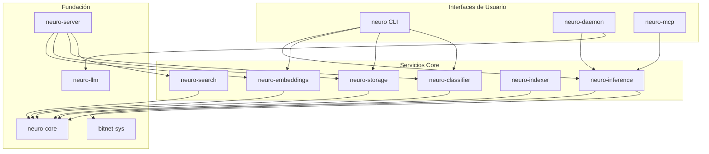
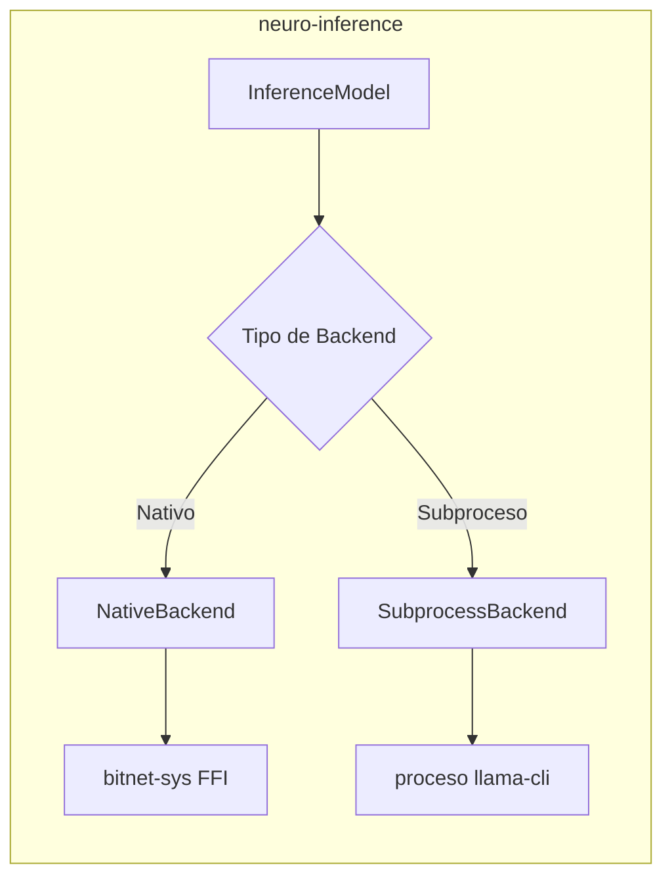
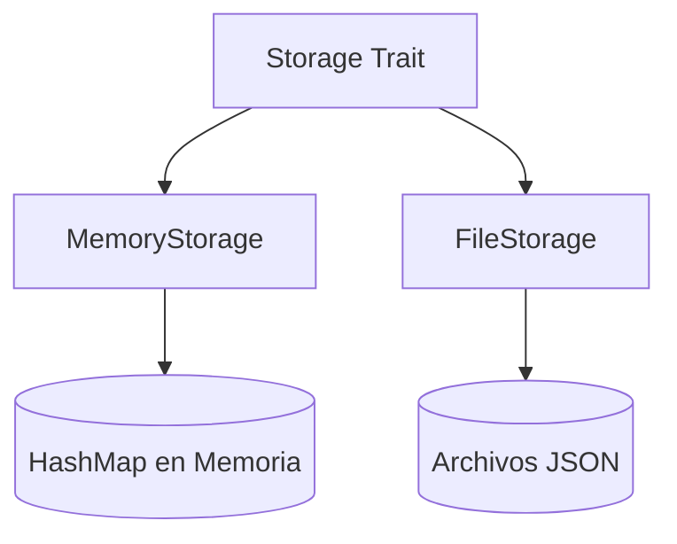
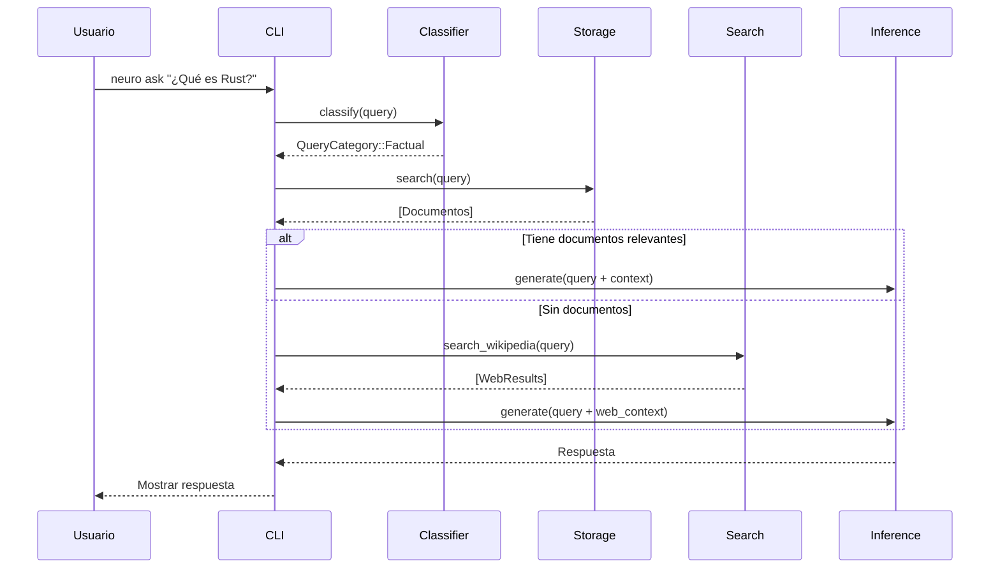
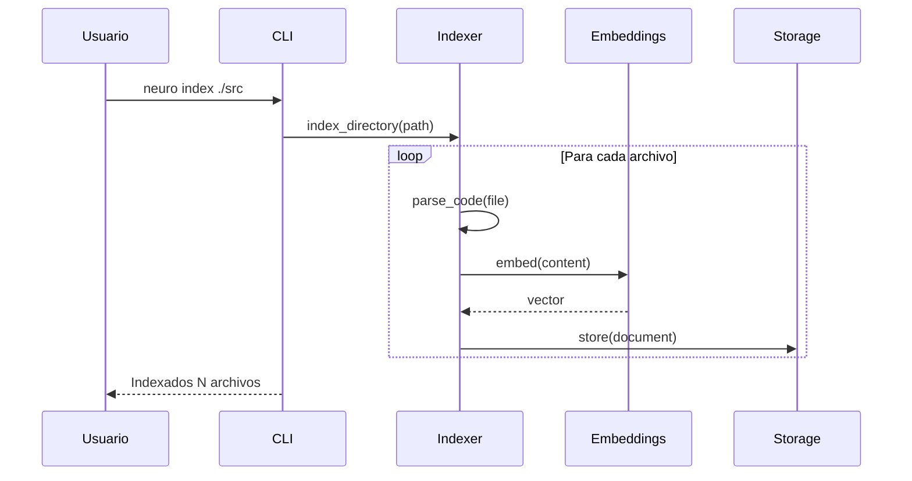
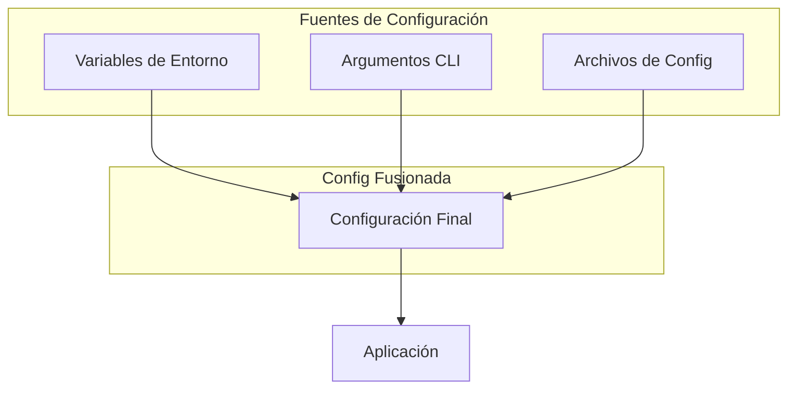

# Descripción de Arquitectura

neuro-bitnet está diseñado como un workspace modular de Rust con 13 crates especializados. Esta arquitectura permite flexibilidad, testeabilidad y la capacidad de usar componentes de forma independiente.

## Arquitectura de Alto Nivel



---

## Resumen de Crates

### Capa de Interfaz de Usuario

| Crate | Binario | Propósito |
|-------|--------|---------|
| `neuro-cli` | `neuro` | Interfaz de línea de comandos para todas las operaciones |
| `neuro-daemon` | `neuro-daemon` | Servidor HTTP en background con API compatible OpenAI |
| `neuro-mcp` | `neuro-mcp` | Servidor Model Context Protocol para integración IDE |

### Servicios Core

| Crate | Propósito | Dependencias Clave |
|-------|---------|------------------|
| `neuro-inference` | Inferencia de modelo BitNet | bitnet-sys, tokio |
| `neuro-embeddings` | Generación de embeddings | fastembed |
| `neuro-classifier` | Categorización de consultas | regex |
| `neuro-search` | Búsqueda web (Wikipedia) | reqwest |
| `neuro-indexer` | Análisis de código | tree-sitter |
| `neuro-storage` | Persistencia de documentos | serde, bincode |

### Capa de Fundación

| Crate | Propósito | Tipos Clave |
|-------|---------|-----------|
| `neuro-core` | Tipos compartidos | Document, SearchResult, QueryCategory |
| `bitnet-sys` | Bindings FFI a bitnet.cpp | Bindings C de bajo nivel |
| `neuro-llm` | Cliente compatible OpenAI | Cliente HTTP para APIs LLM |
| `neuro-server` | Servidor HTTP (RAG) | API REST basada en Axum |

---

## Descripciones Detalladas de Crates

### neuro-core

El crate fundacional que define tipos compartidos usados en todos los demás crates.

```rust
// Tipos clave
pub struct Document {
    pub id: Uuid,
    pub content: String,
    pub metadata: HashMap<String, String>,
    pub embedding: Option<Vec<f32>>,
}

pub struct SearchResult {
    pub document: Document,
    pub score: f32,
}

pub enum QueryCategory {
    Math,
    Code,
    Reasoning,
    Tools,
    Greeting,
    Factual,
    Conversational,
}
```

### neuro-inference

Proporciona inferencia de modelo BitNet con dos backends:



**Features:**
- `native` - Bindings FFI directos (más rápido, ~800ms)
- `subprocess` - Ejecución de proceso (por defecto, ~2.8s)

### neuro-embeddings

Genera embeddings vectoriales usando fastembed:

```rust
pub struct Embedder {
    model: EmbeddingModel,
}

impl Embedder {
    pub fn embed(&self, text: &str) -> Vec<f32>;
    pub fn embed_batch(&self, texts: &[&str]) -> Vec<Vec<f32>>;
}
```

**Modelos Soportados:**
- MiniLM (por defecto, 384 dims)
- BGE (small/base/large)
- GTE (small/base)
- E5 (small/base/large)

### neuro-storage

Almacenamiento de documentos con dos implementaciones:



### neuro-classifier

Clasificación de consultas basada en regex:

```rust
pub fn classify(query: &str) -> QueryCategory {
    // Patrones para cada categoría
    if MATH_PATTERN.is_match(query) { return QueryCategory::Math; }
    if CODE_PATTERN.is_match(query) { return QueryCategory::Code; }
    // ...
}
```

### neuro-indexer

Indexación de código usando tree-sitter:

```rust
pub struct CodeIndexer {
    parsers: HashMap<Language, Parser>,
}

// Lenguajes soportados
pub enum Language {
    Rust,
    Python,
    JavaScript,
    TypeScript,
}
```

### neuro-search

Integración con Wikipedia para aumentar conocimiento:

```rust
pub async fn search_wikipedia(query: &str) -> Vec<WikipediaResult>;
pub async fn get_wikipedia_summary(title: &str) -> String;
```

### bitnet-sys

Bindings FFI de bajo nivel a bitnet.cpp:

```rust
// Bindings C
extern "C" {
    fn bitnet_init(model_path: *const c_char) -> *mut BitnetContext;
    fn bitnet_generate(ctx: *mut BitnetContext, prompt: *const c_char, max_tokens: i32) -> *mut c_char;
    fn bitnet_free(ctx: *mut BitnetContext);
}
```

---

## Flujo de Datos

### Procesamiento de Consultas



### Indexación de Documentos



---

## Selección de Backend

neuro-inference soporta dos backends:

### Backend de Subproceso (Por Defecto)

```
┌─────────────────┐     spawn      ┌─────────────────┐
│  neuro-bitnet   │ ──────────────▶│   llama-cli     │
│   (Rust)        │                │   (bitnet.cpp)  │
└─────────────────┘                └─────────────────┘
        │                                  │
        │◀────── stdout (respuesta) ───────│
```

**Pros:** Configuración fácil, no requiere compilación
**Contras:** Overhead de proceso (~2.8s por solicitud)

### Backend FFI Nativo

```
┌─────────────────┐   llamada FFI  ┌─────────────────┐
│  neuro-bitnet   │ ──────────────▶│   bitnet.cpp    │
│   (Rust)        │◀───────────────│   (enlazado)    │
└─────────────────┘   respuesta    └─────────────────┘
```

**Pros:** Llamadas directas, ~60% más rápido (~800ms)
**Contras:** Requiere compilación con `--features native`

---

## Arquitectura de Configuración



Prioridad: Argumentos CLI > Variables de Entorno > Archivos de Config > Valores por Defecto

---

## Manejo de Errores

Todos los crates usan un tipo de error unificado:

```rust
// neuro-core/src/error.rs
#[derive(Debug, thiserror::Error)]
pub enum NeuroError {
    #[error("Error de inferencia: {0}")]
    Inference(String),
    
    #[error("Error de embedding: {0}")]
    Embedding(String),
    
    #[error("Error de almacenamiento: {0}")]
    Storage(String),
    
    #[error("Error de IO: {0}")]
    Io(#[from] std::io::Error),
}
```

---

## Consideraciones de Rendimiento

### Uso de Memoria

| Componente | Memoria |
|-----------|--------|
| Modelo BitNet 2B | ~1.1 GB |
| Modelo de Embeddings | ~90-400 MB |
| Almacenamiento de Documentos | Variable |
| Pool de Contexto | ~500 MB (nativo) |

### Desglose de Latencia

| Operación | Tiempo |
|-----------|------|
| Clasificación de Consulta | <1ms |
| Generación de Embedding | ~5ms |
| Búsqueda por Similitud (10k docs) | ~2ms |
| Inferencia BitNet (simple) | ~800ms |
| Inferencia BitNet (compleja) | ~2.8s |

---

## Extender neuro-bitnet

### Agregar un Nuevo Crate

1. Crear crate en directorio `crates/`
2. Agregar al workspace en `Cargo.toml` raíz
3. Implementar usando tipos de `neuro-core`
4. Exportar a través de interfaz apropiada (CLI, server, etc.)

### Agregar un Nuevo Modelo de Embeddings

```rust
// En neuro-embeddings/src/models.rs
pub enum EmbeddingModel {
    MiniLM,
    BgeSmall,
    BgeBase,
    TuNuevoModelo,  // Agregar variante
}

impl EmbeddingModel {
    pub fn model_name(&self) -> &str {
        match self {
            Self::TuNuevoModelo => "tu-nombre-de-modelo",
            // ...
        }
    }
}
```

### Agregar una Nueva Categoría de Consulta

```rust
// En neuro-core/src/classification.rs
pub enum QueryCategory {
    // ... existentes
    TuCategoria,
}

// En neuro-classifier/src/patterns/mod.rs
lazy_static! {
    static ref TU_PATRON: Regex = Regex::new(r"tu|patron|aqui").unwrap();
}
```

---

## Próximos Pasos

- [Primeros Pasos](/neuro-bitnet/posts/getting-started-es/) - Guía de instalación
- [Referencia de API](/neuro-bitnet/posts/api-reference-es/) - Documentación de API HTTP
- [Guía del Servidor Daemon](/neuro-bitnet/posts/daemon-server-guide-es/) - Servidor en background
