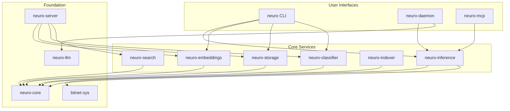
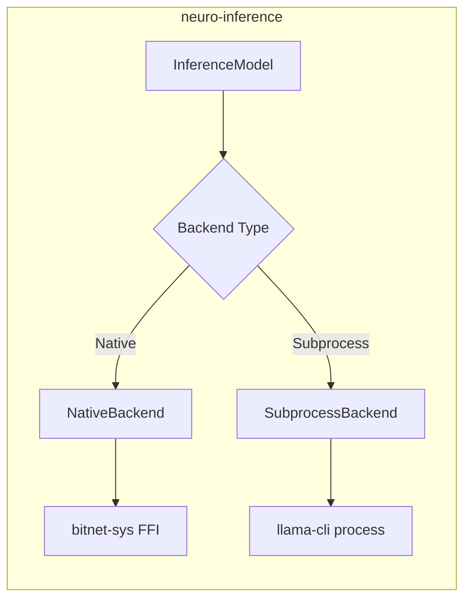
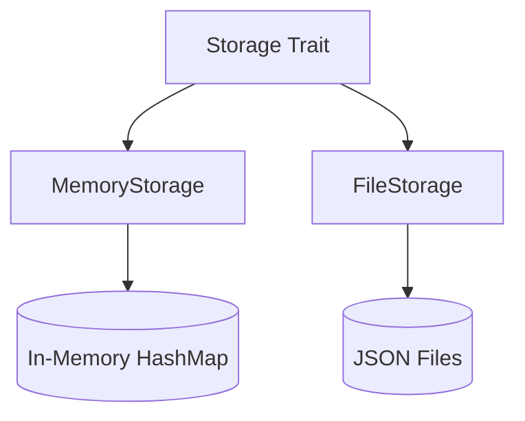
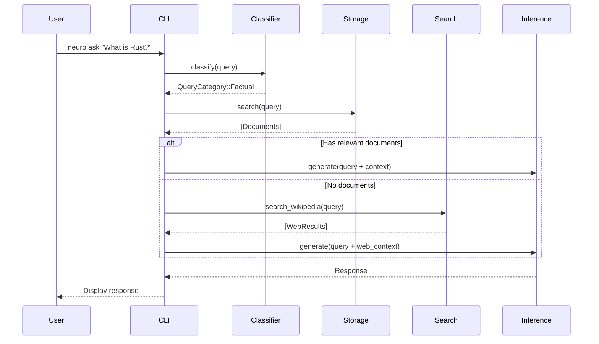
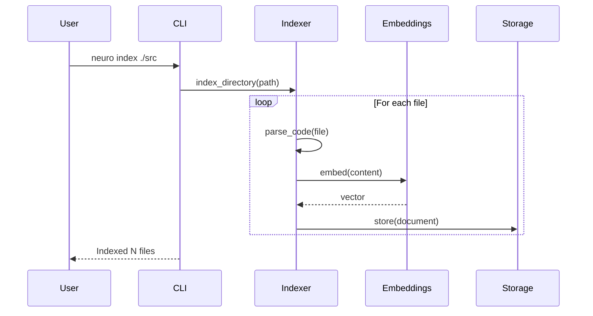
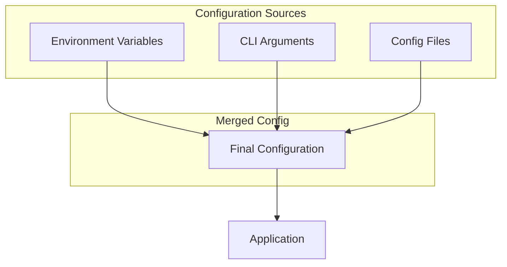

# Architecture Overview

neuro-bitnet is designed as a modular Rust workspace with 13 specialized crates. This architecture enables flexibility, testability, and the ability to use components independently.

## High-Level Architecture



---

## Crate Overview

### User Interface Layer

| Crate | Binary | Purpose |
|-------|--------|---------|
| `neuro-cli` | `neuro` | Command-line interface for all operations |
| `neuro-daemon` | `neuro-daemon` | Background HTTP server with OpenAI-compatible API |
| `neuro-mcp` | `neuro-mcp` | Model Context Protocol server for IDE integration |

### Core Services

| Crate | Purpose | Key Dependencies |
|-------|---------|------------------|
| `neuro-inference` | BitNet model inference | bitnet-sys, tokio |
| `neuro-embeddings` | Embedding generation | fastembed |
| `neuro-classifier` | Query categorization | regex |
| `neuro-search` | Web search (Wikipedia) | reqwest |
| `neuro-indexer` | Code analysis | tree-sitter |
| `neuro-storage` | Document persistence | serde, bincode |

### Foundation Layer

| Crate | Purpose | Key Types |
|-------|---------|-----------|
| `neuro-core` | Shared types | Document, SearchResult, QueryCategory |
| `bitnet-sys` | FFI bindings to bitnet.cpp | Low-level C bindings |
| `neuro-llm` | OpenAI-compatible client | HTTP client for LLM APIs |
| `neuro-server` | HTTP server (RAG) | Axum-based REST API |

---

## Detailed Crate Descriptions

### neuro-core

The foundation crate defining shared types used across all other crates.

```rust
// Key types
pub struct Document {
    pub id: Uuid,
    pub content: String,
    pub metadata: HashMap<String, String>,
    pub embedding: Option<Vec<f32>>,
}

pub struct SearchResult {
    pub document: Document,
    pub score: f32,
}

pub enum QueryCategory {
    Math,
    Code,
    Reasoning,
    Tools,
    Greeting,
    Factual,
    Conversational,
}
```

### neuro-inference

Provides BitNet model inference with two backends:



**Features:**
- `native` - Direct FFI bindings (faster, ~800ms)
- `subprocess` - Process execution (default, ~2.8s)

### neuro-embeddings

Generates vector embeddings using fastembed:

```rust
pub struct Embedder {
    model: EmbeddingModel,
}

impl Embedder {
    pub fn embed(&self, text: &str) -> Vec<f32>;
    pub fn embed_batch(&self, texts: &[&str]) -> Vec<Vec<f32>>;
}
```

**Supported Models:**
- MiniLM (default, 384 dims)
- BGE (small/base/large)
- GTE (small/base)
- E5 (small/base/large)

### neuro-storage

Document storage with two implementations:



### neuro-classifier

Regex-based query classification:

```rust
pub fn classify(query: &str) -> QueryCategory {
    // Patterns for each category
    if MATH_PATTERN.is_match(query) { return QueryCategory::Math; }
    if CODE_PATTERN.is_match(query) { return QueryCategory::Code; }
    // ...
}
```

### neuro-indexer

Code indexing using tree-sitter:

```rust
pub struct CodeIndexer {
    parsers: HashMap<Language, Parser>,
}

// Supported languages
pub enum Language {
    Rust,
    Python,
    JavaScript,
    TypeScript,
}
```

### neuro-search

Wikipedia integration for knowledge augmentation:

```rust
pub async fn search_wikipedia(query: &str) -> Vec<WikipediaResult>;
pub async fn get_wikipedia_summary(title: &str) -> String;
```

### bitnet-sys

Low-level FFI bindings to bitnet.cpp:

```rust
// C bindings
extern "C" {
    fn bitnet_init(model_path: *const c_char) -> *mut BitnetContext;
    fn bitnet_generate(ctx: *mut BitnetContext, prompt: *const c_char, max_tokens: i32) -> *mut c_char;
    fn bitnet_free(ctx: *mut BitnetContext);
}
```

---

## Data Flow

### Query Processing



### Document Indexing



---

## Backend Selection

neuro-inference supports two backends:

### Subprocess Backend (Default)

```
┌─────────────────┐     spawn      ┌─────────────────┐
│  neuro-bitnet   │ ──────────────▶│   llama-cli     │
│   (Rust)        │                │   (bitnet.cpp)  │
└─────────────────┘                └─────────────────┘
        │                                  │
        │◀────── stdout (response) ────────│
```

**Pros:** Easy setup, no compilation required
**Cons:** Process overhead (~2.8s per request)

### Native FFI Backend

```
┌─────────────────┐     FFI call   ┌─────────────────┐
│  neuro-bitnet   │ ──────────────▶│   bitnet.cpp    │
│   (Rust)        │◀───────────────│   (linked)      │
└─────────────────┘   response     └─────────────────┘
```

**Pros:** Direct calls, ~60% faster (~800ms)
**Cons:** Requires compilation with `--features native`

---

## Configuration Architecture



Priority: CLI Arguments > Environment Variables > Config Files > Defaults

---

## Error Handling

All crates use a unified error type:

```rust
// neuro-core/src/error.rs
#[derive(Debug, thiserror::Error)]
pub enum NeuroError {
    #[error("Inference error: {0}")]
    Inference(String),
    
    #[error("Embedding error: {0}")]
    Embedding(String),
    
    #[error("Storage error: {0}")]
    Storage(String),
    
    #[error("IO error: {0}")]
    Io(#[from] std::io::Error),
}
```

---

## Performance Considerations

### Memory Usage

| Component | Memory |
|-----------|--------|
| BitNet 2B Model | ~1.1 GB |
| Embedding Model | ~90-400 MB |
| Document Storage | Variable |
| Context Pool | ~500 MB (native) |

### Latency Breakdown

| Operation | Time |
|-----------|------|
| Query Classification | <1ms |
| Embedding Generation | ~5ms |
| Similarity Search (10k docs) | ~2ms |
| BitNet Inference (simple) | ~800ms |
| BitNet Inference (complex) | ~2.8s |

---

## Extending neuro-bitnet

### Adding a New Crate

1. Create crate in `crates/` directory
2. Add to workspace in root `Cargo.toml`
3. Implement using `neuro-core` types
4. Export through appropriate interface (CLI, server, etc.)

### Adding a New Embedding Model

```rust
// In neuro-embeddings/src/models.rs
pub enum EmbeddingModel {
    MiniLM,
    BgeSmall,
    BgeBase,
    YourNewModel,  // Add variant
}

impl EmbeddingModel {
    pub fn model_name(&self) -> &str {
        match self {
            Self::YourNewModel => "your-model-name",
            // ...
        }
    }
}
```

### Adding a New Query Category

```rust
// In neuro-core/src/classification.rs
pub enum QueryCategory {
    // ... existing
    YourCategory,
}

// In neuro-classifier/src/patterns/mod.rs
lazy_static! {
    static ref YOUR_PATTERN: Regex = Regex::new(r"your|pattern|here").unwrap();
}
```

---

## Next Steps

- [Getting Started](/neuro-bitnet/posts/getting-started/) - Installation guide
- [API Reference](/neuro-bitnet/posts/api-reference/) - HTTP API documentation
- [Daemon Server Guide](/neuro-bitnet/posts/daemon-server-guide/) - Background server
