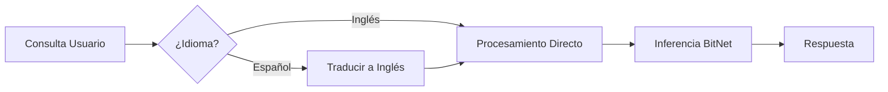

# Guía del Servidor Daemon

El `neuro-daemon` es un servidor HTTP en background que proporciona una **API compatible con OpenAI** para inferencia BitNet. Está diseñado para aplicaciones que necesitan acceso continuo a inferencia de IA local sin iniciar un nuevo proceso para cada solicitud.

## Características

- **API Compatible con OpenAI** - Reemplazo directo para endpoints de OpenAI
- **Auto-Traducción** - Traduce automáticamente consultas en español a inglés para mejor precisión
- **Operación en Background** - Se ejecuta como daemon con soporte de archivo PID
- **Carga de Modelo Instantánea** - Modelo cargado una vez al inicio para respuestas rápidas
- **Soporte de Streaming** - Streaming de tokens en tiempo real (próximamente)

---

## Instalación

El daemon está incluido con neuro-bitnet. Compilar desde código fuente:

```bash
git clone https://github.com/madkoding/neuro-bitnet.git
cd neuro-bitnet
cargo build --release

# Binario ubicado en
./target/release/neuro-daemon
```

O instalar via cargo:

```bash
cargo install neuro-cli
# neuro-daemon está incluido
```

---

## Inicio Rápido

### 1. Configurar BitNet (si no está hecho)

```bash
./scripts/setup_bitnet.sh
neuro model download 2b
```

### 2. Iniciar el Daemon

```bash
# Modo foreground (para pruebas)
neuro-daemon --foreground

# Modo background (producción)
neuro-daemon --pid-file /var/run/neuro-daemon.pid

# Puerto y modelo personalizados
neuro-daemon --port 8000 --model /ruta/al/modelo.gguf --foreground
```

### 3. Probar la API

```bash
curl http://localhost:11435/health
# {"status":"ok","model":"bitnet-2b","auto_translate":true}
```

---

## Referencia de API

### URL Base

```
http://localhost:11435
```

Puerto por defecto es `11435`. Cambiar con el flag `--port`.

---

### Health Check

```http
GET /health
```

**Respuesta:**
```json
{
  "status": "ok",
  "model": "bitnet-2b",
  "auto_translate": true,
  "uptime_seconds": 3600
}
```

---

### Generar Texto

```http
POST /v1/generate
Content-Type: application/json
```

**Solicitud:**
```json
{
  "prompt": "¿Cuál es la capital de Francia?",
  "max_tokens": 256,
  "temperature": 0.7,
  "stream": false
}
```

**Respuesta:**
```json
{
  "id": "gen-123456",
  "object": "text_completion",
  "created": 1735689600,
  "model": "bitnet-2b",
  "choices": [
    {
      "text": "The capital of France is Paris.",
      "index": 0,
      "finish_reason": "stop"
    }
  ],
  "usage": {
    "prompt_tokens": 8,
    "completion_tokens": 7,
    "total_tokens": 15
  }
}
```

#### Con Consulta en Español (Auto-Traducida)

```bash
curl -X POST http://localhost:11435/v1/generate \
  -H "Content-Type: application/json" \
  -d '{"prompt": "¿Cuál es la capital de Francia?"}'
```

El daemon automáticamente:
1. Detecta el idioma español
2. Traduce a inglés: "What is the capital of France?"
3. Genera respuesta con precisión mejorada (56% → 100%)

---

### Completaciones de Chat (Compatible con OpenAI)

```http
POST /v1/chat/completions
Content-Type: application/json
```

**Solicitud:**
```json
{
  "model": "bitnet-2b",
  "messages": [
    {"role": "system", "content": "Eres un asistente útil."},
    {"role": "user", "content": "Explica la computación cuántica en términos simples."}
  ],
  "max_tokens": 512,
  "temperature": 0.7
}
```

**Respuesta:**
```json
{
  "id": "chatcmpl-123456",
  "object": "chat.completion",
  "created": 1735689600,
  "model": "bitnet-2b",
  "choices": [
    {
      "index": 0,
      "message": {
        "role": "assistant",
        "content": "La computación cuántica usa principios de mecánica cuántica..."
      },
      "finish_reason": "stop"
    }
  ],
  "usage": {
    "prompt_tokens": 20,
    "completion_tokens": 150,
    "total_tokens": 170
  }
}
```

---

### Listar Modelos

```http
GET /v1/models
```

**Respuesta:**
```json
{
  "object": "list",
  "data": [
    {
      "id": "bitnet-2b",
      "object": "model",
      "created": 1735689600,
      "owned_by": "local"
    }
  ]
}
```

---

## Configuración

### Opciones de Línea de Comandos

| Opción | Por Defecto | Descripción |
|--------|---------|-------------|
| `--port` | `11435` | Puerto del servidor HTTP |
| `--host` | `127.0.0.1` | Dirección de binding |
| `--model` | Auto-detectar | Ruta al archivo del modelo GGUF |
| `--max-tokens` | `512` | Max tokens por defecto |
| `--temperature` | `0.7` | Temperatura por defecto |
| `--ctx-size` | `4096` | Tamaño de ventana de contexto |
| `--threads` | Auto | Número de hilos de CPU |
| `--auto-translate` | `true` | Habilitar auto-traducción de español |
| `--foreground` | `false` | Ejecutar en foreground (no daemonizar) |
| `--pid-file` | Ninguno | Ruta del archivo PID para modo daemon |
| `--log-level` | `info` | Nivel de log (debug, info, warn, error) |

### Variables de Entorno

| Variable | Descripción |
|----------|-------------|
| `NEURO_DAEMON_PORT` | Sobrescribir puerto por defecto |
| `NEURO_DAEMON_HOST` | Sobrescribir dirección de binding |
| `NEURO_BITNET_MODEL` | Ruta al archivo del modelo |
| `NEURO_LOG_LEVEL` | Verbosidad del log |

---

## Característica de Auto-Traducción

El daemon incluye traducción automática para consultas no inglesas, mejorando significativamente la precisión factual:



### Impacto en Rendimiento

| Métrica | Sin Traducción | Con Traducción |
|--------|---------------------|------------------|
| Precisión | 56% | **100%** |
| Latencia | 1371ms | 1402ms (+2.3%) |

### Deshabilitar Auto-Traducción

```bash
neuro-daemon --auto-translate false --foreground
```

O por solicitud:

```json
{
  "prompt": "¿Cuál es la capital de Francia?",
  "translate": false
}
```

---

## Ejecutar como Servicio

### Servicio systemd

Crear `/etc/systemd/system/neuro-daemon.service`:

```ini
[Unit]
Description=Servidor Daemon neuro-bitnet
After=network.target

[Service]
Type=simple
User=neuro
ExecStart=/usr/local/bin/neuro-daemon --foreground --host 0.0.0.0
Restart=always
RestartSec=10
Environment=NEURO_LOG_LEVEL=info

[Install]
WantedBy=multi-user.target
```

Habilitar e iniciar:

```bash
sudo systemctl enable neuro-daemon
sudo systemctl start neuro-daemon
sudo systemctl status neuro-daemon
```

### Docker

```bash
# Usando docker-compose
cd docker
docker-compose -f docker-compose.bitnet.yml up -d

# O manual
docker run -d \
  --name neuro-daemon \
  -p 11435:11435 \
  -v ~/.cache/neuro-bitnet:/root/.cache/neuro-bitnet \
  ghcr.io/madkoding/neuro-bitnet:latest \
  neuro-daemon --foreground --host 0.0.0.0
```

---

## Ejemplos de Integración

### Python

```python
import requests

def generar(prompt: str) -> str:
    respuesta = requests.post(
        "http://localhost:11435/v1/generate",
        json={"prompt": prompt, "max_tokens": 256}
    )
    return respuesta.json()["choices"][0]["text"]

# Funciona con español
print(generar("¿Qué es la inteligencia artificial?"))
```

### JavaScript/Node.js

```javascript
const respuesta = await fetch('http://localhost:11435/v1/chat/completions', {
  method: 'POST',
  headers: { 'Content-Type': 'application/json' },
  body: JSON.stringify({
    messages: [{ role: 'user', content: '¿Qué es Rust?' }],
    max_tokens: 256
  })
});
const data = await respuesta.json();
console.log(data.choices[0].message.content);
```

### SDK de OpenAI (Reemplazo Directo)

```python
from openai import OpenAI

client = OpenAI(
    base_url="http://localhost:11435/v1",
    api_key="no-necesario"  # El servidor local no requiere API key
)

respuesta = client.chat.completions.create(
    model="bitnet-2b",
    messages=[{"role": "user", "content": "Explica la computación cuántica"}]
)
print(respuesta.choices[0].message.content)
```

---

## Solución de Problemas

### Puerto Ya en Uso

```bash
# Encontrar proceso usando el puerto
lsof -i :11435

# Matar daemon existente
pkill neuro-daemon
```

### Modelo No Encontrado

```bash
# Verificar ubicación del modelo
neuro model info

# Especificar ruta del modelo explícitamente
neuro-daemon --model ~/.cache/neuro-bitnet/models/bitnet-2b.gguf --foreground
```

### Alto Uso de Memoria

Los modelos BitNet son eficientes en memoria, pero puedes limitar el tamaño del contexto:

```bash
neuro-daemon --ctx-size 2048 --foreground
```

### Respuestas Lentas

- Asegúrate de que BitNet fue compilado con optimización TLS: `-DGGML_BITNET_X86_TLS=ON`
- Verifica el número de hilos de CPU: `neuro-daemon --threads 8 --foreground`
- Usa un modelo más pequeño para respuestas más rápidas

---

## Próximos Pasos

- [Guía de Integración MCP](/neuro-bitnet/posts/mcp-integration-guide-es/) - Integración IDE
- [Referencia de API](/neuro-bitnet/posts/api-reference-es/) - Documentación completa de API
- [Descripción de Arquitectura](/neuro-bitnet/posts/architecture-overview-es/) - Diseño del sistema
