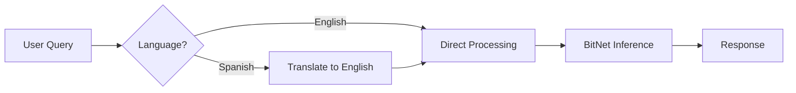

# Daemon Server Guide

The `neuro-daemon` is a background HTTP server that provides an **OpenAI-compatible API** for BitNet inference. It's designed for applications that need continuous access to local AI inference without starting a new process for each request.

## Features

- **OpenAI-Compatible API** - Drop-in replacement for OpenAI endpoints
- **Auto-Translation** - Automatically translates Spanish queries to English for better accuracy
- **Background Operation** - Runs as a daemon with PID file support
- **Hot Model Loading** - Model loaded once at startup for fast responses
- **Streaming Support** - Real-time token streaming (coming soon)

---

## Installation

The daemon is included with neuro-bitnet. Build from source:

```bash
git clone https://github.com/madkoding/neuro-bitnet.git
cd neuro-bitnet
cargo build --release

# Binary located at
./target/release/neuro-daemon
```

Or install via cargo:

```bash
cargo install neuro-cli
# neuro-daemon is included
```

---

## Quick Start

### 1. Setup BitNet (if not done)

```bash
./scripts/setup_bitnet.sh
neuro model download 2b
```

### 2. Start the Daemon

```bash
# Foreground mode (for testing)
neuro-daemon --foreground

# Background mode (production)
neuro-daemon --pid-file /var/run/neuro-daemon.pid

# Custom port and model
neuro-daemon --port 8000 --model /path/to/model.gguf --foreground
```

### 3. Test the API

```bash
curl http://localhost:11435/health
# {"status":"ok","model":"bitnet-2b","auto_translate":true}
```

---

## API Reference

### Base URL

```
http://localhost:11435
```

Default port is `11435`. Change with `--port` flag.

---

### Health Check

```http
GET /health
```

**Response:**
```json
{
  "status": "ok",
  "model": "bitnet-2b",
  "auto_translate": true,
  "uptime_seconds": 3600
}
```

---

### Generate Text

```http
POST /v1/generate
Content-Type: application/json
```

**Request:**
```json
{
  "prompt": "What is the capital of France?",
  "max_tokens": 256,
  "temperature": 0.7,
  "stream": false
}
```

**Response:**
```json
{
  "id": "gen-123456",
  "object": "text_completion",
  "created": 1735689600,
  "model": "bitnet-2b",
  "choices": [
    {
      "text": "The capital of France is Paris.",
      "index": 0,
      "finish_reason": "stop"
    }
  ],
  "usage": {
    "prompt_tokens": 8,
    "completion_tokens": 7,
    "total_tokens": 15
  }
}
```

#### With Spanish Query (Auto-Translated)

```bash
curl -X POST http://localhost:11435/v1/generate \
  -H "Content-Type: application/json" \
  -d '{"prompt": "¿Cuál es la capital de Francia?"}'
```

The daemon automatically:
1. Detects Spanish language
2. Translates to English: "What is the capital of France?"
3. Generates response with improved accuracy (56% → 100%)

---

### Chat Completions (OpenAI-Compatible)

```http
POST /v1/chat/completions
Content-Type: application/json
```

**Request:**
```json
{
  "model": "bitnet-2b",
  "messages": [
    {"role": "system", "content": "You are a helpful assistant."},
    {"role": "user", "content": "Explain quantum computing in simple terms."}
  ],
  "max_tokens": 512,
  "temperature": 0.7
}
```

**Response:**
```json
{
  "id": "chatcmpl-123456",
  "object": "chat.completion",
  "created": 1735689600,
  "model": "bitnet-2b",
  "choices": [
    {
      "index": 0,
      "message": {
        "role": "assistant",
        "content": "Quantum computing uses quantum mechanics principles..."
      },
      "finish_reason": "stop"
    }
  ],
  "usage": {
    "prompt_tokens": 20,
    "completion_tokens": 150,
    "total_tokens": 170
  }
}
```

---

### List Models

```http
GET /v1/models
```

**Response:**
```json
{
  "object": "list",
  "data": [
    {
      "id": "bitnet-2b",
      "object": "model",
      "created": 1735689600,
      "owned_by": "local"
    }
  ]
}
```

---

## Configuration

### Command-Line Options

| Option | Default | Description |
|--------|---------|-------------|
| `--port` | `11435` | HTTP server port |
| `--host` | `127.0.0.1` | Bind address |
| `--model` | Auto-detect | Path to GGUF model file |
| `--max-tokens` | `512` | Default max tokens |
| `--temperature` | `0.7` | Default temperature |
| `--ctx-size` | `4096` | Context window size |
| `--threads` | Auto | Number of CPU threads |
| `--auto-translate` | `true` | Enable Spanish auto-translation |
| `--foreground` | `false` | Run in foreground (don't daemonize) |
| `--pid-file` | None | PID file path for daemon mode |
| `--log-level` | `info` | Log level (debug, info, warn, error) |

### Environment Variables

| Variable | Description |
|----------|-------------|
| `NEURO_DAEMON_PORT` | Override default port |
| `NEURO_DAEMON_HOST` | Override bind address |
| `NEURO_BITNET_MODEL` | Path to model file |
| `NEURO_LOG_LEVEL` | Log verbosity |

---

## Auto-Translation Feature

The daemon includes automatic translation for non-English queries, significantly improving factual accuracy:



### Performance Impact

| Metric | Without Translation | With Translation |
|--------|---------------------|------------------|
| Accuracy | 56% | **100%** |
| Latency | 1371ms | 1402ms (+2.3%) |

### Disable Auto-Translation

```bash
neuro-daemon --auto-translate false --foreground
```

Or per-request:

```json
{
  "prompt": "¿Cuál es la capital de Francia?",
  "translate": false
}
```

---

## Running as a Service

### systemd Service

Create `/etc/systemd/system/neuro-daemon.service`:

```ini
[Unit]
Description=neuro-bitnet Daemon Server
After=network.target

[Service]
Type=simple
User=neuro
ExecStart=/usr/local/bin/neuro-daemon --foreground --host 0.0.0.0
Restart=always
RestartSec=10
Environment=NEURO_LOG_LEVEL=info

[Install]
WantedBy=multi-user.target
```

Enable and start:

```bash
sudo systemctl enable neuro-daemon
sudo systemctl start neuro-daemon
sudo systemctl status neuro-daemon
```

### Docker

```bash
# Using docker-compose
cd docker
docker-compose -f docker-compose.bitnet.yml up -d

# Or manual
docker run -d \
  --name neuro-daemon \
  -p 11435:11435 \
  -v ~/.cache/neuro-bitnet:/root/.cache/neuro-bitnet \
  ghcr.io/madkoding/neuro-bitnet:latest \
  neuro-daemon --foreground --host 0.0.0.0
```

---

## Integration Examples

### Python

```python
import requests

def generate(prompt: str) -> str:
    response = requests.post(
        "http://localhost:11435/v1/generate",
        json={"prompt": prompt, "max_tokens": 256}
    )
    return response.json()["choices"][0]["text"]

# Works with Spanish
print(generate("¿Qué es la inteligencia artificial?"))
```

### JavaScript/Node.js

```javascript
const response = await fetch('http://localhost:11435/v1/chat/completions', {
  method: 'POST',
  headers: { 'Content-Type': 'application/json' },
  body: JSON.stringify({
    messages: [{ role: 'user', content: 'What is Rust?' }],
    max_tokens: 256
  })
});
const data = await response.json();
console.log(data.choices[0].message.content);
```

### OpenAI SDK (Drop-in Replacement)

```python
from openai import OpenAI

client = OpenAI(
    base_url="http://localhost:11435/v1",
    api_key="not-needed"  # Local server doesn't require API key
)

response = client.chat.completions.create(
    model="bitnet-2b",
    messages=[{"role": "user", "content": "Explain quantum computing"}]
)
print(response.choices[0].message.content)
```

---

## Troubleshooting

### Port Already in Use

```bash
# Find process using port
lsof -i :11435

# Kill existing daemon
pkill neuro-daemon
```

### Model Not Found

```bash
# Check model location
neuro model info

# Specify model path explicitly
neuro-daemon --model ~/.cache/neuro-bitnet/models/bitnet-2b.gguf --foreground
```

### High Memory Usage

BitNet models are memory-efficient, but you can limit context size:

```bash
neuro-daemon --ctx-size 2048 --foreground
```

### Slow Responses

- Ensure BitNet was compiled with TLS optimization: `-DGGML_BITNET_X86_TLS=ON`
- Check CPU thread count: `neuro-daemon --threads 8 --foreground`
- Use a smaller model for faster responses

---

## Next Steps

- [MCP Integration Guide](/neuro-bitnet/posts/mcp-integration-guide/) - IDE integration
- [API Reference](/neuro-bitnet/posts/api-reference/) - Full API documentation
- [Architecture Overview](/neuro-bitnet/posts/architecture-overview/) - System design
