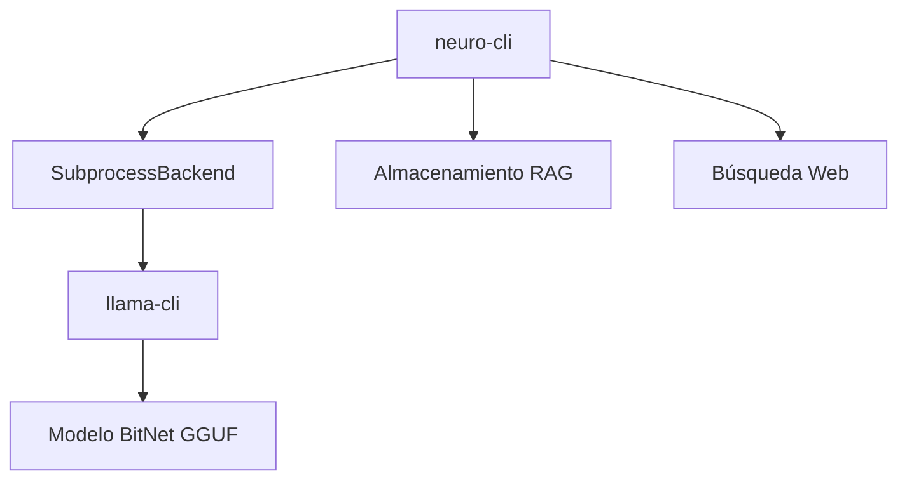

# Inferencia Local con BitNet

neuro-bitnet proporciona inferencia local **solo CPU** usando los modelos BitNet 1.58-bit de Microsoft. Estos modelos son extremadamente eficientes gracias a su cuantización ternaria.

## Características

- **Solo CPU**: Optimizado específicamente para procesadores modernos
- **Modelos BitNet**: Solo modelos 1.58-bit de Microsoft
- **Auto-descarga**: Descarga automática de modelos con verificación SHA256
- **Streaming**: Respuestas en tiempo real con `--stream`
- **RAG Integrado**: Combinar con búsqueda semántica y web

## Requisitos

### Compilar bitnet.cpp

Para usar inferencia local, necesitas compilar el runtime bitnet.cpp:

```bash
# Opción 1: Script automático (recomendado)
./scripts/setup_bitnet.sh

# Opción 2: Manual
git clone https://github.com/microsoft/BitNet.git ~/.local/share/bitnet.cpp
cd ~/.local/share/bitnet.cpp
mkdir build && cd build
cmake .. -DGGML_BITNET_X86_TLS=ON
cmake --build . --config Release -j$(nproc)
mkdir -p ~/.local/bin
cp bin/llama-cli ~/.local/bin/llama-cli-bitnet
```

### Requisitos del Sistema

- **clang >= 18**: Requerido para optimizaciones 1.58-bit
- **cmake >= 3.14**

#### Ubuntu/Debian
```bash
sudo apt install clang-18 cmake build-essential
```

#### Arch Linux
```bash
sudo pacman -S clang cmake
```

#### macOS
```bash
brew install llvm cmake
export PATH="/opt/homebrew/opt/llvm/bin:$PATH"
```

## Modelos Soportados

| Modelo | Tamaño | Descripción | ID |
|-------|------|-------------|-----|
| BitNet b1.58 2B-4T | 1.19 GB | Modelo principal, 2B params | `2b` |
| BitNet b1.58 Large | 0.7 GB | Modelo base 0.7B | `large` |
| BitNet b1.58 3B | 3.3 GB | Modelo grande 3B | `3b` |
| Llama3 8B 1.58 | 8 GB | Llama3 8B cuantizado a 1.58-bit | `8b` |

## Uso Básico

### Descarga Automática de Modelo

La primera vez que ejecutes `neuro ask`, se te pedirá descargar el modelo:

```bash
neuro ask "¿Qué es BitNet?" --translate

# Saltar confirmación
neuro ask "¿Qué es BitNet?" --yes --translate

# Usar un modelo específico
neuro ask "¿Qué es BitNet?" --model 3b --translate
```

### Gestión de Modelos

```bash
# Listar modelos disponibles
neuro model list

# Descargar un modelo específico
neuro model download 2b

# Eliminar un modelo
neuro model remove 2b

# Ver información del caché
neuro model info
```

### Con Streaming (respuesta en tiempo real)

```bash
neuro ask "Explica la teoría de la relatividad" --stream --translate
```

### Con Contexto RAG

```bash
# Primero indexar algunos documentos
neuro index ./docs --recursive

# Luego preguntar con contexto
neuro ask "Resume la documentación" --storage ./data --translate
```

## Arquitectura



## Configuración

### Variables de Entorno

| Variable | Por Defecto | Descripción |
|----------|---------|-------------|
| `BITNET_CLI_PATH` | Auto-detectar | Ruta al binario llama-cli |
| `NEURO_BITNET_MODELS_DIR` | `~/.cache/neuro-bitnet/models` | Directorio de caché de modelos |

### Opciones CLI

```bash
neuro ask "pregunta" [OPCIONES]

Opciones:
  --model <NOMBRE>      Modelo a usar (2b, large, 3b, 8b) [por defecto: 2b]
  --max-tokens <N>      Máximo de tokens a generar [por defecto: 512]
  --temperature <F>     Temperatura para muestreo [por defecto: 0.7]
  --ctx-size <N>        Tamaño de ventana de contexto [por defecto: 4096]
  --threads <N>         Número de hilos [por defecto: auto]
  --stream              Habilitar salida en streaming
  --yes                 Auto-confirmar descargas
  --web                 Habilitar contexto de búsqueda web
  --storage <RUTA>      Ruta al almacenamiento RAG
  --translate           Traducir consulta a inglés para mejor precisión
  --timing              Mostrar información de tiempo
  --verbose             Habilitar salida detallada
```

## Solución de Problemas

### Binario no encontrado

```bash
# Verificar si el binario existe
which llama-cli-bitnet

# Establecer ruta manualmente
export BITNET_CLI_PATH="/ruta/a/llama-cli"
```

### Falla la descarga del modelo

```bash
# Eliminar descarga parcial
neuro model remove 2b

# Intentar de nuevo con flag force
neuro model download 2b --force
```

### Inferencia lenta

- Asegúrate de compilar con optimización TLS: `-DGGML_BITNET_X86_TLS=ON`
- Usa menos hilos si la CPU está sobrecargada
- Considera usar un modelo más pequeño (2b en lugar de 8b)

---

## Próximos Pasos

- [Resultados de Benchmark BitNet](/neuro-bitnet/posts/bitnet-benchmark-results-es/) - Análisis de rendimiento
- [Guía del Servidor Daemon](/neuro-bitnet/posts/daemon-server-guide-es/) - Servidor HTTP en background
- [Primeros Pasos](/neuro-bitnet/posts/getting-started-es/) - Guía de instalación completa
