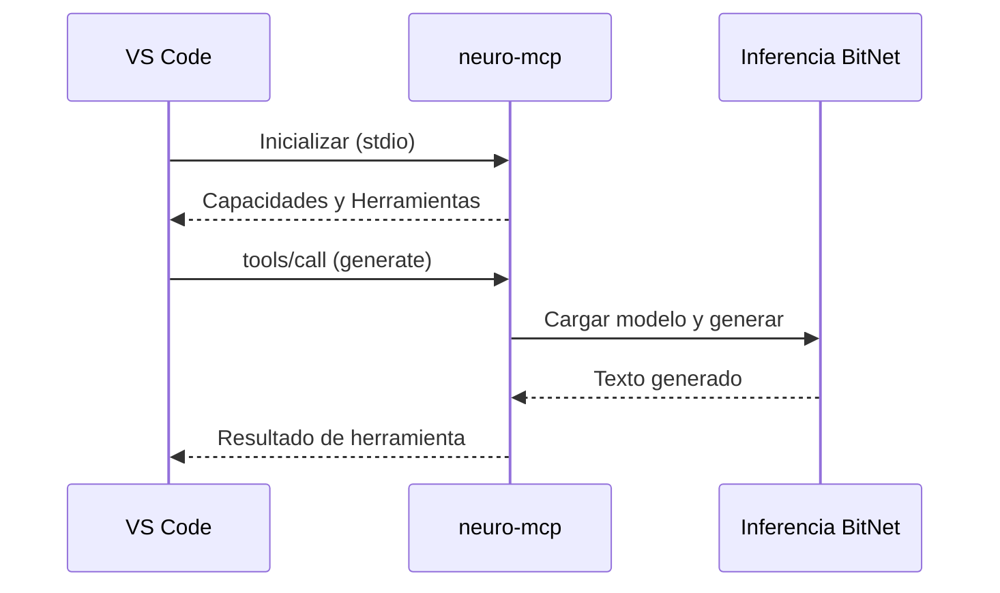

# Guía de Integración MCP

El servidor **Model Context Protocol (MCP)** habilita la integración perfecta de neuro-bitnet con IDEs como VS Code, permitiéndote usar inferencia BitNet directamente desde tu editor.

## ¿Qué es MCP?

MCP (Model Context Protocol) es un protocolo estándar para conectar modelos de IA con herramientas de desarrollo. El servidor `neuro-mcp` implementa este protocolo, permitiendo que los IDEs:

- Generen texto desde prompts
- Traduzcan texto a inglés
- Hagan preguntas con contexto
- Resuman documentos

---

## Instalación

El servidor MCP está incluido con neuro-bitnet:

```bash
# Compilar desde código fuente
git clone https://github.com/madkoding/neuro-bitnet.git
cd neuro-bitnet
cargo build --release

# Binario ubicado en
./target/release/neuro-mcp
```

---

## Inicio Rápido

### 1. Configurar BitNet

```bash
./scripts/setup_bitnet.sh
neuro model download 2b
```

### 2. Probar el Servidor MCP

```bash
# Ejecutar en modo debug para ver la comunicación
neuro-mcp --debug
```

### 3. Configurar tu IDE

Ver secciones de configuración abajo para IDEs específicos.

---

## Configuración de VS Code

### Opción 1: Usando Copilot Chat MCP

Agregar a la configuración de VS Code (`.vscode/settings.json` o configuración de usuario):

```json
{
  "github.copilot.chat.mcpServers": {
    "neuro-bitnet": {
      "command": "neuro-mcp",
      "args": []
    }
  }
}
```

### Opción 2: Usando Extensión MCP

1. Instalar la extensión MCP desde el marketplace de VS Code
2. Agregar a `settings.json`:

```json
{
  "mcp.servers": {
    "neuro-bitnet": {
      "command": "/ruta/a/neuro-mcp",
      "args": ["--model", "/ruta/al/modelo.gguf"],
      "env": {
        "NEURO_LOG_LEVEL": "info"
      }
    }
  }
}
```

### Opción 3: Configuración de Workspace

Crear `.vscode/mcp.json` en tu proyecto:

```json
{
  "servers": {
    "neuro-bitnet": {
      "command": "neuro-mcp",
      "args": [],
      "description": "Inferencia BitNet local con neuro-bitnet"
    }
  }
}
```

---

## Herramientas Disponibles

El servidor MCP expone las siguientes herramientas:

### 1. `generate` - Generar Texto

Genera texto desde un prompt usando inferencia BitNet.

**Parámetros:**
| Parámetro | Tipo | Requerido | Descripción |
|-----------|------|----------|-------------|
| `prompt` | string | Sí | El prompt de entrada |
| `max_tokens` | number | No | Máximo de tokens (por defecto: 256) |
| `temperature` | number | No | Temperatura de muestreo (por defecto: 0.7) |

**Ejemplo:**
```json
{
  "tool": "generate",
  "arguments": {
    "prompt": "Explica qué es el ownership en Rust",
    "max_tokens": 512
  }
}
```

---

### 2. `translate` - Traducir a Inglés

Traduce texto de cualquier idioma a inglés.

**Parámetros:**
| Parámetro | Tipo | Requerido | Descripción |
|-----------|------|----------|-------------|
| `text` | string | Sí | Texto a traducir |

**Ejemplo:**
```json
{
  "tool": "translate",
  "arguments": {
    "text": "¿Qué es la programación funcional?"
  }
}
```

**Respuesta:**
```
What is functional programming?
```

---

### 3. `ask` - Hacer una Pregunta

Hace una pregunta con contexto opcional para mejores respuestas.

**Parámetros:**
| Parámetro | Tipo | Requerido | Descripción |
|-----------|------|----------|-------------|
| `question` | string | Sí | La pregunta a hacer |
| `context` | string | No | Contexto adicional |
| `max_tokens` | number | No | Máximo de tokens (por defecto: 512) |

**Ejemplo:**
```json
{
  "tool": "ask",
  "arguments": {
    "question": "¿Qué hace esta función?",
    "context": "fn fibonacci(n: u32) -> u32 { if n <= 1 { n } else { fibonacci(n-1) + fibonacci(n-2) } }"
  }
}
```

---

### 4. `summarize` - Resumir Texto

Resume texto largo en un resumen conciso.

**Parámetros:**
| Parámetro | Tipo | Requerido | Descripción |
|-----------|------|----------|-------------|
| `text` | string | Sí | Texto a resumir |
| `max_length` | number | No | Longitud objetivo del resumen (por defecto: 100) |

**Ejemplo:**
```json
{
  "tool": "summarize",
  "arguments": {
    "text": "Contenido largo del documento aquí...",
    "max_length": 50
  }
}
```

---

## Arquitectura



El servidor MCP:
1. Se comunica via **stdio** (entrada/salida estándar)
2. Usa el protocolo JSON-RPC 2.0
3. Carga el modelo BitNet en la primera solicitud
4. Cachea el modelo para solicitudes subsecuentes

---

## Opciones de Línea de Comandos

```bash
neuro-mcp [OPCIONES]

Opciones:
  --model <RUTA>       Ruta al archivo del modelo GGUF (auto-detectado si no se especifica)
  --max-tokens <N>     Max tokens por defecto [por defecto: 256]
  --temperature <F>    Temperatura por defecto [por defecto: 0.7]
  --ctx-size <N>       Tamaño de ventana de contexto [por defecto: 4096]
  --threads <N>        Número de hilos de CPU [por defecto: auto]
  --debug              Habilitar logging de debug a stderr
  --help               Mostrar información de ayuda
```

### Variables de Entorno

| Variable | Descripción |
|----------|-------------|
| `NEURO_BITNET_MODEL` | Ruta al archivo del modelo |
| `NEURO_LOG_LEVEL` | Nivel de log (debug, info, warn, error) |
| `BITNET_CLI_PATH` | Ruta al binario llama-cli |

---

## Ejemplos de Uso

### En VS Code con Copilot

Una vez configurado, puedes usar las herramientas de neuro-bitnet en Copilot Chat:

```
@neuro-bitnet genera una función para calcular números primos
```

```
@neuro-bitnet translate "¿Cómo implemento un árbol binario?"
```

```
@neuro-bitnet resume el código seleccionado
```

### Uso Programático

Para integraciones personalizadas, puedes comunicarte con el servidor MCP directamente:

```python
import subprocess
import json

# Iniciar servidor MCP
proc = subprocess.Popen(
    ['neuro-mcp'],
    stdin=subprocess.PIPE,
    stdout=subprocess.PIPE,
    text=True
)

# Enviar solicitud de inicialización
request = {
    "jsonrpc": "2.0",
    "id": 1,
    "method": "initialize",
    "params": {
        "protocolVersion": "2024-11-05",
        "capabilities": {},
        "clientInfo": {"name": "test", "version": "1.0"}
    }
}
proc.stdin.write(json.dumps(request) + '\n')
proc.stdin.flush()

# Leer respuesta
response = json.loads(proc.stdout.readline())
print(response)
```

---

## Soporte Multilingüe

El servidor MCP soporta consultas en español (y otros idiomas) a través de traducción automática:

```json
{
  "tool": "generate",
  "arguments": {
    "prompt": "¿Cuál es la diferencia entre let y const en JavaScript?"
  }
}
```

El servidor:
1. Detecta el idioma español
2. Traduce a inglés
3. Genera respuesta con precisión mejorada

---

## Solución de Problemas

### El Servidor No Inicia

```bash
# Verificar si el binario existe
which neuro-mcp

# Ejecutar con salida de debug
neuro-mcp --debug 2>&1 | head -20
```

### Modelo No Encontrado

```bash
# Verificar ubicación del modelo
neuro model info

# Especificar modelo explícitamente
neuro-mcp --model ~/.cache/neuro-bitnet/models/bitnet-2b.gguf --debug
```

### VS Code No Detecta el Servidor

1. Reiniciar VS Code después de cambios de configuración
2. Verificar la Consola de Desarrollador de VS Code para errores (Ayuda > Alternar Herramientas de Desarrollador)
3. Verificar que la ruta a `neuro-mcp` es correcta y ejecutable

### Primera Respuesta Lenta

La primera solicitud carga el modelo en memoria (~2-3 segundos). Las solicitudes subsecuentes son más rápidas (~800ms).

### Depurar Comunicación

Habilitar modo debug para ver todos los mensajes JSON-RPC:

```bash
neuro-mcp --debug 2>mcp-debug.log
```

---

## Comparación: Daemon vs MCP

| Característica | neuro-daemon | neuro-mcp |
|---------|--------------|-----------|
| Protocolo | HTTP (REST) | JSON-RPC (stdio) |
| Caso de Uso | Aplicaciones, scripts | Integración IDE |
| Inicio | Servicio en background | Bajo demanda |
| Múltiples Clientes | Sí | Cliente único |
| Puerto Requerido | Sí (11435) | No |

Usar **neuro-daemon** para:
- Aplicaciones web
- Múltiples clientes concurrentes
- Servicios de larga duración

Usar **neuro-mcp** para:
- Integración con VS Code
- Flujos de trabajo IDE de usuario único
- Integración directa con editor

---

## Próximos Pasos

- [Guía del Servidor Daemon](/neuro-bitnet/posts/daemon-server-guide-es/) - Servidor API HTTP
- [Referencia de API](/neuro-bitnet/posts/api-reference-es/) - Documentación completa de API
- [Primeros Pasos](/neuro-bitnet/posts/getting-started-es/) - Guía de instalación
