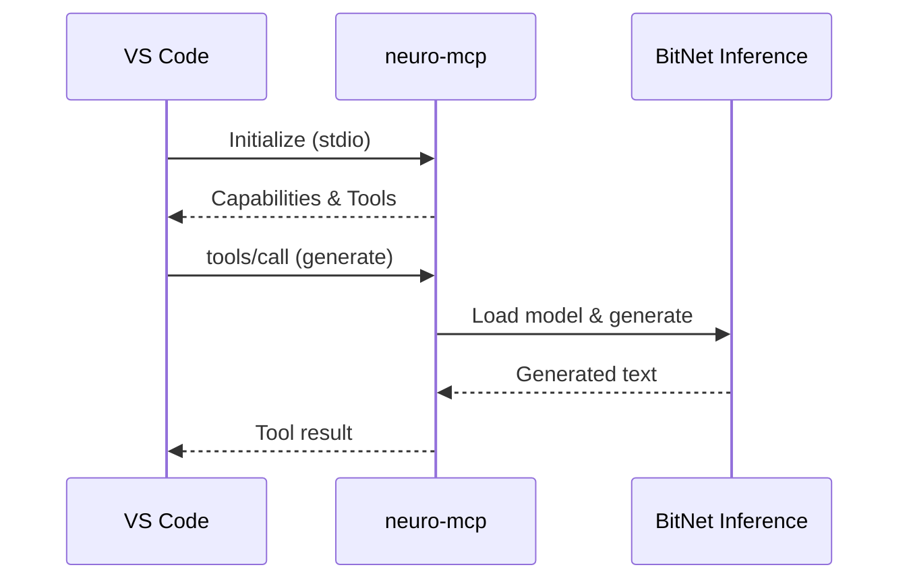

# MCP Integration Guide

The **Model Context Protocol (MCP)** server enables seamless integration of neuro-bitnet with IDEs like VS Code, allowing you to use BitNet inference directly from your editor.

## What is MCP?

MCP (Model Context Protocol) is a standard protocol for connecting AI models to development tools. The `neuro-mcp` server implements this protocol, allowing IDEs to:

- Generate text from prompts
- Translate text to English
- Ask questions with context
- Summarize documents

---

## Installation

The MCP server is included with neuro-bitnet:

```bash
# Build from source
git clone https://github.com/madkoding/neuro-bitnet.git
cd neuro-bitnet
cargo build --release

# Binary located at
./target/release/neuro-mcp
```

---

## Quick Start

### 1. Setup BitNet

```bash
./scripts/setup_bitnet.sh
neuro model download 2b
```

### 2. Test MCP Server

```bash
# Run in debug mode to see communication
neuro-mcp --debug
```

### 3. Configure Your IDE

See configuration sections below for specific IDEs.

---

## VS Code Configuration

### Option 1: Using Copilot Chat MCP

Add to your VS Code settings (`.vscode/settings.json` or user settings):

```json
{
  "github.copilot.chat.mcpServers": {
    "neuro-bitnet": {
      "command": "neuro-mcp",
      "args": []
    }
  }
}
```

### Option 2: Using MCP Extension

1. Install the MCP extension from VS Code marketplace
2. Add to `settings.json`:

```json
{
  "mcp.servers": {
    "neuro-bitnet": {
      "command": "/path/to/neuro-mcp",
      "args": ["--model", "/path/to/model.gguf"],
      "env": {
        "NEURO_LOG_LEVEL": "info"
      }
    }
  }
}
```

### Option 3: Workspace Configuration

Create `.vscode/mcp.json` in your project:

```json
{
  "servers": {
    "neuro-bitnet": {
      "command": "neuro-mcp",
      "args": [],
      "description": "Local BitNet inference with neuro-bitnet"
    }
  }
}
```

---

## Available Tools

The MCP server exposes the following tools:

### 1. `generate` - Generate Text

Generate text from a prompt using BitNet inference.

**Parameters:**
| Parameter | Type | Required | Description |
|-----------|------|----------|-------------|
| `prompt` | string | Yes | The input prompt |
| `max_tokens` | number | No | Maximum tokens (default: 256) |
| `temperature` | number | No | Sampling temperature (default: 0.7) |

**Example:**
```json
{
  "tool": "generate",
  "arguments": {
    "prompt": "Explain what Rust ownership is",
    "max_tokens": 512
  }
}
```

---

### 2. `translate` - Translate to English

Translate text from any language to English.

**Parameters:**
| Parameter | Type | Required | Description |
|-----------|------|----------|-------------|
| `text` | string | Yes | Text to translate |

**Example:**
```json
{
  "tool": "translate",
  "arguments": {
    "text": "¿Qué es la programación funcional?"
  }
}
```

**Response:**
```
What is functional programming?
```

---

### 3. `ask` - Ask a Question

Ask a question with optional context for better answers.

**Parameters:**
| Parameter | Type | Required | Description |
|-----------|------|----------|-------------|
| `question` | string | Yes | The question to ask |
| `context` | string | No | Additional context |
| `max_tokens` | number | No | Maximum tokens (default: 512) |

**Example:**
```json
{
  "tool": "ask",
  "arguments": {
    "question": "What does this function do?",
    "context": "fn fibonacci(n: u32) -> u32 { if n <= 1 { n } else { fibonacci(n-1) + fibonacci(n-2) } }"
  }
}
```

---

### 4. `summarize` - Summarize Text

Summarize long text into a concise summary.

**Parameters:**
| Parameter | Type | Required | Description |
|-----------|------|----------|-------------|
| `text` | string | Yes | Text to summarize |
| `max_length` | number | No | Target summary length (default: 100) |

**Example:**
```json
{
  "tool": "summarize",
  "arguments": {
    "text": "Long document content here...",
    "max_length": 50
  }
}
```

---

## Architecture



The MCP server:
1. Communicates via **stdio** (standard input/output)
2. Uses JSON-RPC 2.0 protocol
3. Loads BitNet model on first request
4. Caches model for subsequent requests

---

## Command-Line Options

```bash
neuro-mcp [OPTIONS]

Options:
  --model <PATH>       Path to GGUF model file (auto-detected if not specified)
  --max-tokens <N>     Default max tokens [default: 256]
  --temperature <F>    Default temperature [default: 0.7]
  --ctx-size <N>       Context window size [default: 4096]
  --threads <N>        Number of CPU threads [default: auto]
  --debug              Enable debug logging to stderr
  --help               Show help information
```

### Environment Variables

| Variable | Description |
|----------|-------------|
| `NEURO_BITNET_MODEL` | Path to model file |
| `NEURO_LOG_LEVEL` | Log level (debug, info, warn, error) |
| `BITNET_CLI_PATH` | Path to llama-cli binary |

---

## Usage Examples

### In VS Code with Copilot

Once configured, you can use neuro-bitnet tools in Copilot Chat:

```
@neuro-bitnet generate a function to calculate prime numbers
```

```
@neuro-bitnet translate "¿Cómo implemento un árbol binario?"
```

```
@neuro-bitnet summarize the selected code
```

### Programmatic Usage

For custom integrations, you can communicate with the MCP server directly:

```python
import subprocess
import json

# Start MCP server
proc = subprocess.Popen(
    ['neuro-mcp'],
    stdin=subprocess.PIPE,
    stdout=subprocess.PIPE,
    text=True
)

# Send initialize request
request = {
    "jsonrpc": "2.0",
    "id": 1,
    "method": "initialize",
    "params": {
        "protocolVersion": "2024-11-05",
        "capabilities": {},
        "clientInfo": {"name": "test", "version": "1.0"}
    }
}
proc.stdin.write(json.dumps(request) + '\n')
proc.stdin.flush()

# Read response
response = json.loads(proc.stdout.readline())
print(response)
```

---

## Multilingual Support

The MCP server supports queries in Spanish (and other languages) through automatic translation:

```json
{
  "tool": "generate",
  "arguments": {
    "prompt": "¿Cuál es la diferencia entre let y const en JavaScript?"
  }
}
```

The server will:
1. Detect Spanish language
2. Translate to English
3. Generate response with improved accuracy

---

## Troubleshooting

### Server Not Starting

```bash
# Check if binary exists
which neuro-mcp

# Run with debug output
neuro-mcp --debug 2>&1 | head -20
```

### Model Not Found

```bash
# Check model location
neuro model info

# Specify model explicitly
neuro-mcp --model ~/.cache/neuro-bitnet/models/bitnet-2b.gguf --debug
```

### VS Code Not Detecting Server

1. Restart VS Code after configuration changes
2. Check VS Code Developer Console for errors (Help > Toggle Developer Tools)
3. Verify the path to `neuro-mcp` is correct and executable

### Slow First Response

The first request loads the model into memory (~2-3 seconds). Subsequent requests are faster (~800ms).

### Debug Communication

Enable debug mode to see all JSON-RPC messages:

```bash
neuro-mcp --debug 2>mcp-debug.log
```

---

## Comparison: Daemon vs MCP

| Feature | neuro-daemon | neuro-mcp |
|---------|--------------|-----------|
| Protocol | HTTP (REST) | JSON-RPC (stdio) |
| Use Case | Applications, scripts | IDE integration |
| Startup | Background service | On-demand |
| Multiple Clients | Yes | Single client |
| Port Required | Yes (11435) | No |

Use **neuro-daemon** for:
- Web applications
- Multiple concurrent clients
- Long-running services

Use **neuro-mcp** for:
- VS Code integration
- Single-user IDE workflows
- Direct editor integration

---

## Next Steps

- [Daemon Server Guide](/neuro-bitnet/posts/daemon-server-guide/) - HTTP API server
- [API Reference](/neuro-bitnet/posts/api-reference/) - Full API documentation
- [Getting Started](/neuro-bitnet/posts/getting-started/) - Installation guide
