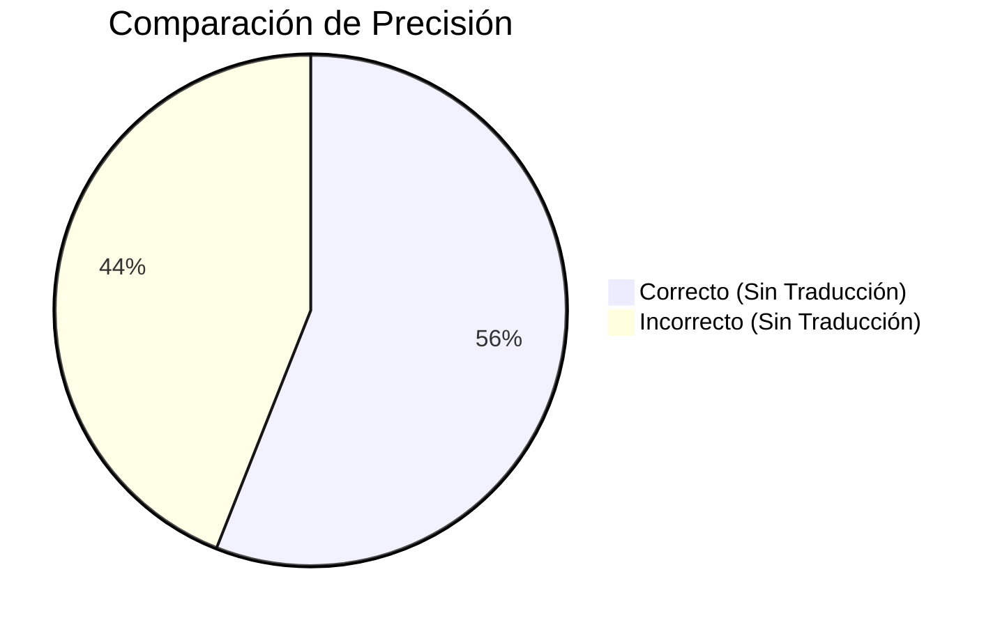
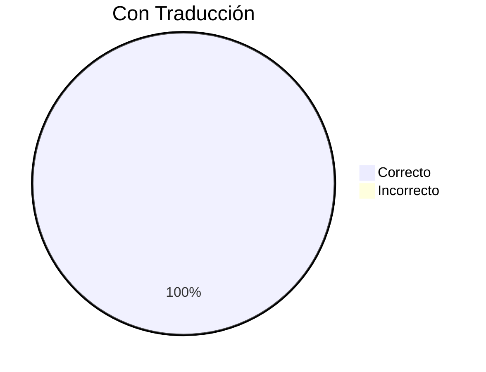
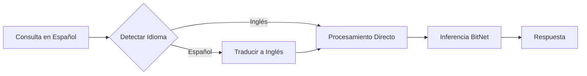

# Reporte de Benchmark de Traducción

## Resumen Ejecutivo

Este benchmark evalúa la efectividad de usar BitNet para traducción de consultas para mejorar la precisión factual en consultas no inglesas.

| Métrica | Sin Traducción | Con Traducción | Mejora |
|--------|---------------------|------------------|-------------|
| **Precisión** | 56% | **100%** | **+44%** |
| **Tiempo de Respuesta Promedio** | 1371ms | 1402ms | +31ms |
| **Overhead** | - | +2.3% | Mínimo |

**Conclusión:** Usar BitNet para traducir consultas no inglesas a inglés antes de responder mejora dramáticamente la precisión factual con impacto de rendimiento insignificante.

---

## Por Qué Importa la Traducción

Los modelos BitNet, como la mayoría de los LLMs, fueron entrenados principalmente con datos en inglés. Cuando se hacen preguntas en español (u otros idiomas), la precisión factual del modelo baja significativamente:





---

## Metodología

### Pipeline de Traducción



1. **Detección de Idioma**: Detección basada en patrones usando marcadores del español (¿, ¡, ñ, á, é, í, ó, ú) y palabras comunes
2. **Traducción**: BitNet traduce la consulta a inglés usando el prompt: `"Translate to English: {query}"`
3. **Generación de Respuesta**: BitNet responde la pregunta en inglés con mejor precisión factual
4. **Respuesta**: La respuesta se devuelve (en inglés, ya que el conocimiento factual del modelo es más fuerte)

### Configuración de Prueba

- **Modelo:** BitNet-b1.58-2B-4T (2.4B parámetros, 1.1GB)
- **Iteraciones por pregunta:** 5
- **Max tokens:** 30
- **Temperatura:** 0.7
- **Preguntas probadas:** 5 preguntas factuales en español

---

## Resultados Detallados

### Sin Traducción (Español Directo)

| Pregunta | Correctas | Precisión | Tiempo Promedio |
|----------|---------|----------|----------|
| ¿Cuál es la capital de Francia? | 0/5 | 0% | 1377ms |
| ¿Cuántos continentes hay? | 4/5 | 80% | 1359ms |
| ¿Cuál es el planeta más grande del sistema solar? | 1/5 | 20% | 1384ms |
| ¿Quién escribió Don Quijote? | 5/5 | 100% | 1376ms |
| ¿Quién pintó la Mona Lisa? | 4/5 | 80% | 1360ms |
| **Total** | **14/25** | **56%** | **1371ms** |

> ⚠️ **Problema Crítico:** El modelo responde incorrectamente "Madrid" para "capital de Francia" cuando se pregunta en español.

### Con Traducción (BitNet Traduce)

| Pregunta | Traducida A | Correctas | Precisión | Tiempo Promedio |
|----------|---------------|---------|----------|----------|
| ¿Cuál es la capital de Francia? | What is the capital of France? | 5/5 | 100% | 1373ms |
| ¿Cuántos continentes hay? | How many continents are there? | 5/5 | 100% | 1421ms |
| ¿Cuál es el planeta más grande del sistema solar? | What is the largest planet in the solar system? | 5/5 | 100% | 1424ms |
| ¿Quién escribió Don Quijote? | Who wrote Don Quixote? | 5/5 | 100% | 1405ms |
| ¿Quién pintó la Mona Lisa? | Who painted the Mona Lisa? | 5/5 | 100% | 1388ms |
| **Total** | - | **25/25** | **100%** | **1402ms** |

---

## Análisis de Rendimiento

### Overhead de Traducción

| Fase | Tiempo |
|-------|------|
| Detección de Idioma | <1ms (coincidencia de patrones) |
| Generación de Traducción | ~200ms (10-20 tokens) |
| Generación de Respuesta | ~1200ms |
| **Overhead Total** | **~31ms (+2.3%)** |

### Por Qué Funciona la Traducción

1. **Sesgo de Datos de Entrenamiento**: BitNet fue entrenado principalmente con datos en inglés, resultando en conocimiento factual más fuerte en inglés
2. **Precisión Semántica**: Traducir a inglés permite al modelo acceder a su base de conocimiento core
3. **Bajo Overhead**: La traducción requiere solo ~10-20 tokens, añadiendo latencia mínima

---

## Ejemplos de Salida

### Sin Traducción ❌

```
P: ¿Cuál es la capital de Francia?
R: La capital de Francia es Madrid.
```

### Con Traducción ✓

```
P: ¿Cuál es la capital de Francia?
→ Traducida: What is the capital of France?
R: The capital of France is Paris.
```

---

## Uso

### CLI

```bash
# Habilitar traducción con flag --translate
neuro ask "¿Cuál es la capital de Francia?" --translate

# Salida:
# 🌐 Traduciendo a inglés...
# ✨ Generando respuesta...
# The capital of France is Paris.
```

### Daemon (Auto-Traducción Habilitada por Defecto)

```bash
# Iniciar daemon
neuro-daemon --foreground

# Consulta en español - automáticamente traducida
curl -X POST http://localhost:11435/v1/generate \
  -H "Content-Type: application/json" \
  -d '{"prompt": "¿Cuál es la capital de Francia?"}'

# Respuesta: "The capital of France is Paris."
```

### Deshabilitar Auto-Traducción

```bash
# CLI
neuro ask "¿Cuál es la capital de Francia?"  # Sin flag --translate

# Daemon
neuro-daemon --auto-translate false --foreground
```

---

## Recomendaciones

Basado en estos resultados de benchmark, recomendamos:

1. ✅ **Habilitar traducción por defecto** para consultas no inglesas para mejorar precisión
2. ✅ **Usar para preguntas factuales** donde la precisión es crítica
3. ⚠️ **Considerar idioma de respuesta** - actualmente devuelve respuestas en inglés
4. 🔮 **Mejora futura**: Opción para traducir la respuesta de vuelta al idioma original

---

## Ejecutar el Benchmark

Puedes reproducir estos resultados:

```bash
# Ejecutar el benchmark de traducción
./benchmarks/benchmark_bitnet_translation.sh

# O manualmente
for i in {1..5}; do
  neuro ask "¿Cuál es la capital de Francia?" --timing
  neuro ask "¿Cuál es la capital de Francia?" --translate --timing
done
```

---

## Apéndice: Patrones de Detección de Idioma

El detector de idioma usa estos patrones para español:

```rust
// Patrones de caracteres
const SPANISH_CHARS: &str = "¿¡ñáéíóúü";

// Patrones de palabras
const SPANISH_WORDS: &[&str] = &[
    "qué", "cómo", "cuál", "cuándo", "dónde", "por qué",
    "el", "la", "los", "las", "un", "una",
    "es", "son", "está", "están",
    "de", "del", "en", "con", "para", "por"
];

pub fn is_spanish(text: &str) -> bool {
    // Verificar caracteres específicos del español
    if text.chars().any(|c| SPANISH_CHARS.contains(c)) {
        return true;
    }
    
    // Verificar palabras comunes en español
    let lower = text.to_lowercase();
    SPANISH_WORDS.iter().any(|word| lower.contains(word))
}
```

---

## Próximos Pasos

- [Guía del Servidor Daemon](/neuro-bitnet/posts/daemon-server-guide-es/) - Auto-traducción en daemon
- [Primeros Pasos](/neuro-bitnet/posts/getting-started-es/) - Guía de instalación
- [Resultados de Benchmark BitNet](/neuro-bitnet/posts/bitnet-benchmark-results-es/) - Benchmark general
