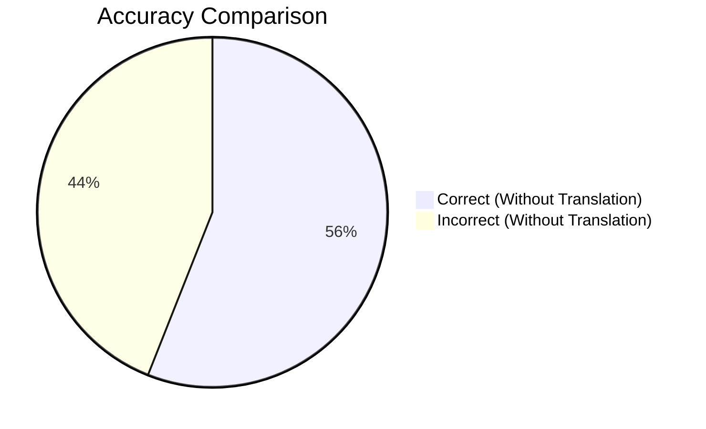
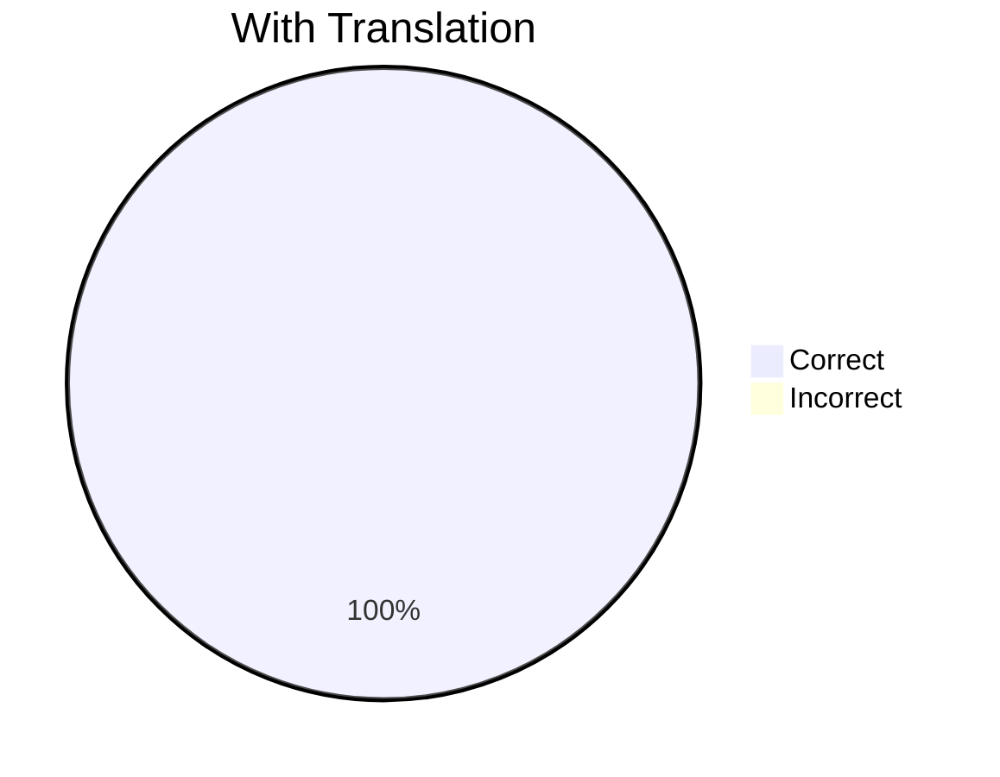
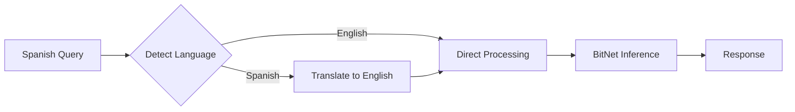

# Translation Benchmark Report

## Executive Summary

This benchmark evaluates the effectiveness of using BitNet itself for query translation to improve factual accuracy on non-English queries.

| Metric | Without Translation | With Translation | Improvement |
|--------|---------------------|------------------|-------------|
| **Accuracy** | 56% | **100%** | **+44%** |
| **Avg Response Time** | 1371ms | 1402ms | +31ms |
| **Overhead** | - | +2.3% | Minimal |

**Conclusion:** Using BitNet to translate non-English queries to English before answering dramatically improves factual accuracy with negligible performance impact.

---

## Why Translation Matters

BitNet models, like most LLMs, were primarily trained on English data. When asked questions in Spanish (or other languages), the model's factual accuracy drops significantly:





---

## Methodology

### Translation Pipeline



1. **Language Detection**: Pattern-based detection using Spanish markers (¿, ¡, ñ, á, é, í, ó, ú) and common words
2. **Translation**: BitNet translates the query to English using prompt: `"Translate to English: {query}"`
3. **Answer Generation**: BitNet answers the English question with better factual accuracy
4. **Response**: Answer returned (in English, as the model's factual knowledge is stronger)

### Test Configuration

- **Model:** BitNet-b1.58-2B-4T (2.4B parameters, 1.1GB)
- **Iterations per question:** 5
- **Max tokens:** 30
- **Temperature:** 0.7
- **Questions tested:** 5 factual questions in Spanish

---

## Detailed Results

### Without Translation (Spanish Direct)

| Question | Correct | Accuracy | Avg Time |
|----------|---------|----------|----------|
| ¿Cuál es la capital de Francia? | 0/5 | 0% | 1377ms |
| ¿Cuántos continentes hay? | 4/5 | 80% | 1359ms |
| ¿Cuál es el planeta más grande del sistema solar? | 1/5 | 20% | 1384ms |
| ¿Quién escribió Don Quijote? | 5/5 | 100% | 1376ms |
| ¿Quién pintó la Mona Lisa? | 4/5 | 80% | 1360ms |
| **Total** | **14/25** | **56%** | **1371ms** |

> ⚠️ **Critical Issue:** The model incorrectly answers "Madrid" for "capital of France" when asked in Spanish.

### With Translation (BitNet Translates)

| Question | Translated To | Correct | Accuracy | Avg Time |
|----------|---------------|---------|----------|----------|
| ¿Cuál es la capital de Francia? | What is the capital of France? | 5/5 | 100% | 1373ms |
| ¿Cuántos continentes hay? | How many continents are there? | 5/5 | 100% | 1421ms |
| ¿Cuál es el planeta más grande del sistema solar? | What is the largest planet in the solar system? | 5/5 | 100% | 1424ms |
| ¿Quién escribió Don Quijote? | Who wrote Don Quixote? | 5/5 | 100% | 1405ms |
| ¿Quién pintó la Mona Lisa? | Who painted the Mona Lisa? | 5/5 | 100% | 1388ms |
| **Total** | - | **25/25** | **100%** | **1402ms** |

---

## Performance Analysis

### Translation Overhead

| Phase | Time |
|-------|------|
| Language Detection | <1ms (pattern matching) |
| Translation Generation | ~200ms (10-20 tokens) |
| Answer Generation | ~1200ms |
| **Total Overhead** | **~31ms (+2.3%)** |

### Why Translation Works

1. **Training Data Bias**: BitNet was primarily trained on English data, resulting in stronger factual knowledge in English
2. **Semantic Accuracy**: Translating to English allows the model to access its core knowledge base
3. **Low Overhead**: Translation requires only ~10-20 tokens, adding minimal latency

---

## Sample Outputs

### Without Translation ❌

```
Q: ¿Cuál es la capital de Francia?
A: La capital de Francia es Madrid.
```

### With Translation ✓

```
Q: ¿Cuál es la capital de Francia?
→ Translated: What is the capital of France?
A: The capital of France is Paris.
```

---

## Usage

### CLI

```bash
# Enable translation with --translate flag
neuro ask "¿Cuál es la capital de Francia?" --translate

# Output:
# 🌐 Translating to English...
# ✨ Generating response...
# The capital of France is Paris.
```

### Daemon (Auto-Translation Enabled by Default)

```bash
# Start daemon
neuro-daemon --foreground

# Query in Spanish - automatically translated
curl -X POST http://localhost:11435/v1/generate \
  -H "Content-Type: application/json" \
  -d '{"prompt": "¿Cuál es la capital de Francia?"}'

# Response: "The capital of France is Paris."
```

### Disable Auto-Translation

```bash
# CLI
neuro ask "¿Cuál es la capital de Francia?"  # No --translate flag

# Daemon
neuro-daemon --auto-translate false --foreground
```

---

## Recommendations

Based on these benchmark results, we recommend:

1. ✅ **Enable translation by default** for non-English queries to improve accuracy
2. ✅ **Use for factual questions** where accuracy is critical
3. ⚠️ **Consider response language** - currently returns English answers
4. 🔮 **Future enhancement**: Option to translate response back to original language

---

## Running the Benchmark

You can reproduce these results:

```bash
# Run the translation benchmark
./benchmarks/benchmark_bitnet_translation.sh

# Or manually
for i in {1..5}; do
  neuro ask "¿Cuál es la capital de Francia?" --timing
  neuro ask "¿Cuál es la capital de Francia?" --translate --timing
done
```

---

## Appendix: Language Detection Patterns

The language detector uses these patterns for Spanish:

```rust
// Character patterns
const SPANISH_CHARS: &str = "¿¡ñáéíóúü";

// Word patterns
const SPANISH_WORDS: &[&str] = &[
    "qué", "cómo", "cuál", "cuándo", "dónde", "por qué",
    "el", "la", "los", "las", "un", "una",
    "es", "son", "está", "están",
    "de", "del", "en", "con", "para", "por"
];

pub fn is_spanish(text: &str) -> bool {
    // Check for Spanish-specific characters
    if text.chars().any(|c| SPANISH_CHARS.contains(c)) {
        return true;
    }
    
    // Check for common Spanish words
    let lower = text.to_lowercase();
    SPANISH_WORDS.iter().any(|word| lower.contains(word))
}
```

---

## Next Steps

- [Daemon Server Guide](/neuro-bitnet/posts/daemon-server-guide/) - Auto-translation in daemon
- [Getting Started](/neuro-bitnet/posts/getting-started/) - Installation guide
- [BitNet Benchmark Results](/neuro-bitnet/posts/bitnet-benchmark-results/) - General benchmark
