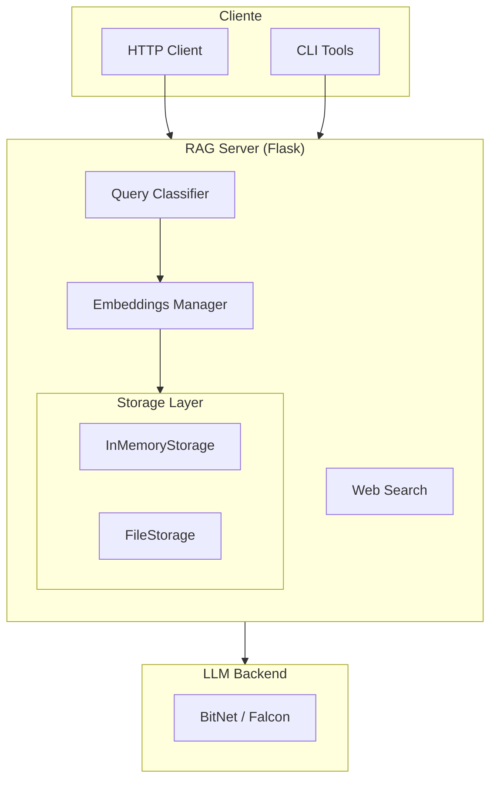
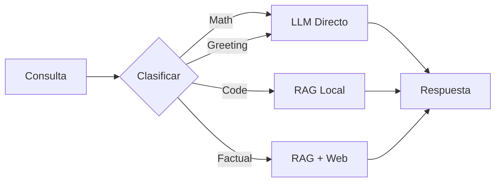

# Arquitectura del Sistema

## Principios de Diseño

neuro-bitnet sigue los principios **SOLID** para mantener el código modular, testeable y extensible.

### Diagrama de Alto Nivel



### Flujo de Clasificación



## Estructura del Proyecto

```
neuro-bitnet/
├── src/
│   ├── rag/                 # Módulo principal RAG
│   │   ├── core.py          # Modelos de datos
│   │   ├── classifier.py    # Clasificación de consultas
│   │   ├── embeddings.py    # Gestión de embeddings
│   │   ├── web_search.py    # Búsqueda web opcional
│   │   ├── storage/         # Backends de almacenamiento
│   │   │   ├── base.py      # Interface ABCStorage
│   │   │   ├── memory.py    # Almacenamiento en memoria
│   │   │   └── files.py     # Almacenamiento en archivos
│   │   └── indexer/         # Analizadores de código
│   │       ├── base.py      # Interface ABCAnalyzer
│   │       ├── python.py    # Analizador Python (AST)
│   │       └── generic.py   # Analizador genérico (regex)
│   ├── server/              # Servidor HTTP
│   │   └── rag_server.py    # Flask application
│   └── cli/                 # Herramientas CLI
│       ├── rag_client.py    # Cliente de consultas
│       └── index_project.py # Indexador de proyectos
├── docker/                  # Configuración Docker
├── tests/                   # Tests unitarios e integración
└── docs/                    # Documentación (Jekyll)
```

## Módulos Principales

### QueryClassifier

Clasifica consultas para determinar la estrategia óptima.

```python
from src.rag.classifier import QueryClassifier, QueryCategory

classifier = QueryClassifier()
result = classifier.classify("¿Cuál es la capital de Francia?")

print(result.category)    # QueryCategory.FACTUAL
print(result.strategy)    # QueryStrategy.RAG_THEN_WEB
print(result.confidence)  # 0.85
```

### ABCStorage (Interface)

Interface abstracta para backends de almacenamiento.

```python
from abc import ABC, abstractmethod

class ABCStorage(ABC):
    @abstractmethod
    def add_document(self, doc: Document) -> str: ...
    
    @abstractmethod
    def search(self, embedding, user_id, top_k) -> List[SearchResult]: ...
    
    @abstractmethod
    def get_document(self, doc_id, user_id) -> Optional[Document]: ...
```

### ABCAnalyzer (Interface)

Interface para analizadores de código.

```python
from abc import ABC, abstractmethod

class ABCAnalyzer(ABC):
    @abstractmethod
    def can_analyze(self, file_path: str) -> bool: ...
    
    @abstractmethod
    def analyze(self, file_path, content) -> List[CodeElement]: ...
```

## Flujo de una Consulta

1. **Clasificación**: El `QueryClassifier` analiza la consulta
2. **Estrategia**: Se determina si usar RAG, Web, o respuesta directa
3. **Búsqueda** (si aplica): Se buscan documentos relevantes
4. **Contexto**: Se construye el contexto para el LLM
5. **Inferencia**: El LLM genera la respuesta
6. **Respuesta**: Se retorna al cliente con fuentes

## Extensibilidad

### Añadir nuevo Storage

```python
from src.rag.storage.base import ABCStorage

class PostgresStorage(ABCStorage):
    def initialize(self, user_id: str) -> None:
        # Crear tablas si no existen
        pass
    
    def add_document(self, doc: Document) -> str:
        # INSERT INTO documents ...
        pass
```

### Añadir nuevo Analyzer

```python
from src.rag.indexer.base import ABCAnalyzer

class KotlinAnalyzer(ABCAnalyzer):
    @property
    def supported_extensions(self) -> List[str]:
        return ['.kt', '.kts']
    
    def analyze(self, file_path, content) -> List[CodeElement]:
        # Analizar código Kotlin
        pass
```
