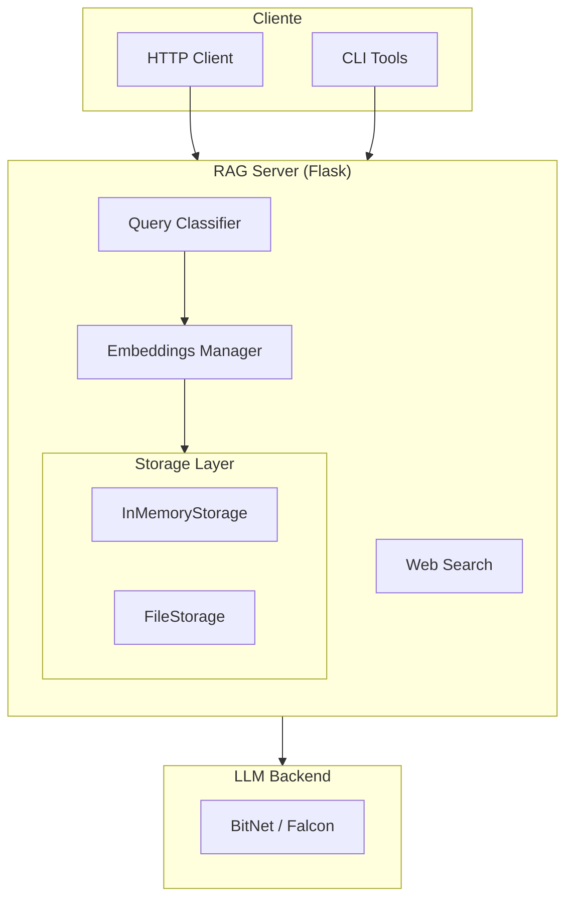
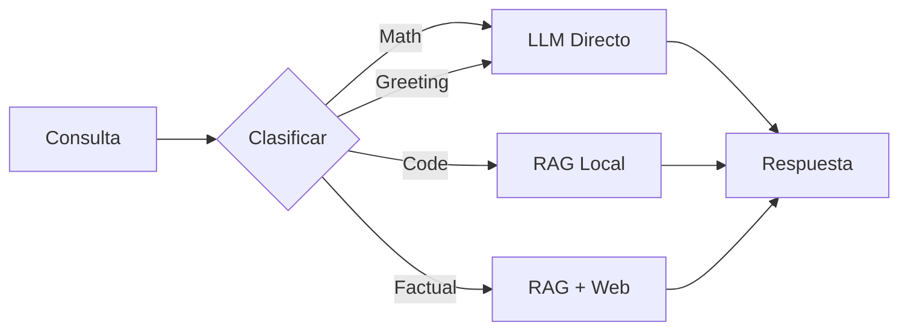

# Arquitectura del Sistema

## Principios de Diseño

neuro-bitnet sigue los principios **SOLID** para mantener el código modular, testeable y extensible.

### Diagrama de Alto Nivel



### Flujo de Clasificación



## Estructura del Proyecto

<ul class="tree">
  <li><strong>src/</strong> - Código fuente
    <ul>
      <li><strong>rag/</strong> - Módulo principal RAG
        <ul>
          <li><code>core.py</code> - Modelos de datos</li>
          <li><code>classifier.py</code> - Clasificación de consultas</li>
          <li><code>embeddings.py</code> - Gestión de embeddings</li>
          <li><code>web_search.py</code> - Búsqueda web opcional</li>
          <li><strong>storage/</strong> - Backends de almacenamiento
            <ul>
              <li><code>base.py</code> - Interface ABCStorage</li>
              <li><code>memory.py</code> - Almacenamiento en memoria</li>
              <li><code>files.py</code> - Almacenamiento en archivos</li>
            </ul>
          </li>
          <li><strong>indexer/</strong> - Analizadores de código
            <ul>
              <li><code>base.py</code> - Interface ABCAnalyzer</li>
              <li><code>python.py</code> - Analizador Python (AST)</li>
              <li><code>generic.py</code> - Analizador genérico (regex)</li>
            </ul>
          </li>
        </ul>
      </li>
      <li><strong>server/</strong> - Servidor HTTP
        <ul>
          <li><code>rag_server.py</code> - Flask application</li>
        </ul>
      </li>
      <li><strong>cli/</strong> - Herramientas CLI
        <ul>
          <li><code>rag_client.py</code> - Cliente de consultas</li>
          <li><code>index_project.py</code> - Indexador de proyectos</li>
        </ul>
      </li>
    </ul>
  </li>
  <li><strong>docker/</strong> - Configuración Docker</li>
  <li><strong>tests/</strong> - Tests unitarios e integración</li>
  <li><strong>docs/</strong> - Documentación (Jekyll)</li>
</ul>

## Módulos Principales

### QueryClassifier

Clasifica consultas para determinar la estrategia óptima.

```python
from src.rag.classifier import QueryClassifier, QueryCategory

classifier = QueryClassifier()
result = classifier.classify("¿Cuál es la capital de Francia?")

print(result.category)    # QueryCategory.FACTUAL
print(result.strategy)    # QueryStrategy.RAG_THEN_WEB
print(result.confidence)  # 0.85
```

### ABCStorage (Interface)

Interface abstracta para backends de almacenamiento.

```python
from abc import ABC, abstractmethod

class ABCStorage(ABC):
    @abstractmethod
    def add_document(self, doc: Document) -> str: ...
    
    @abstractmethod
    def search(self, embedding, user_id, top_k) -> List[SearchResult]: ...
    
    @abstractmethod
    def get_document(self, doc_id, user_id) -> Optional[Document]: ...
```

### ABCAnalyzer (Interface)

Interface para analizadores de código.

```python
from abc import ABC, abstractmethod

class ABCAnalyzer(ABC):
    @abstractmethod
    def can_analyze(self, file_path: str) -> bool: ...
    
    @abstractmethod
    def analyze(self, file_path, content) -> List[CodeElement]: ...
```

## Flujo de una Consulta

1. **Clasificación**: El `QueryClassifier` analiza la consulta
2. **Estrategia**: Se determina si usar RAG, Web, o respuesta directa
3. **Búsqueda** (si aplica): Se buscan documentos relevantes
4. **Contexto**: Se construye el contexto para el LLM
5. **Inferencia**: El LLM genera la respuesta
6. **Respuesta**: Se retorna al cliente con fuentes

## Extensibilidad

### Añadir nuevo Storage

```python
from src.rag.storage.base import ABCStorage

class PostgresStorage(ABCStorage):
    def initialize(self, user_id: str) -> None:
        # Crear tablas si no existen
        pass
    
    def add_document(self, doc: Document) -> str:
        # INSERT INTO documents ...
        pass
```

### Añadir nuevo Analyzer

```python
from src.rag.indexer.base import ABCAnalyzer

class KotlinAnalyzer(ABCAnalyzer):
    @property
    def supported_extensions(self) -> List[str]:
        return ['.kt', '.kts']
    
    def analyze(self, file_path, content) -> List[CodeElement]:
        # Analizar código Kotlin
        pass
```
