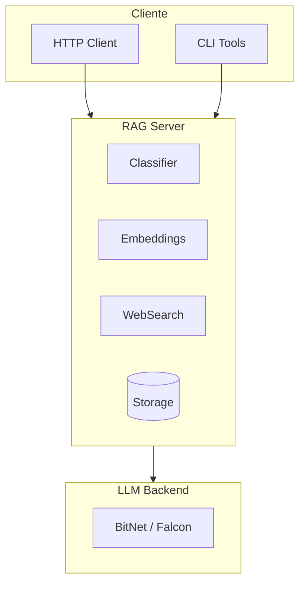

<div style="text-align: center; margin-bottom: 2rem;">
  <h1>🧠 neuro-bitnet</h1>
  <p style="font-size: 1.2rem; color: #666;">
    Servidor RAG inteligente con clasificación automática de consultas
  </p>
</div>

## ¿Qué es neuro-bitnet?

**neuro-bitnet** es un sistema de Retrieval-Augmented Generation (RAG) diseñado para mejorar las respuestas de modelos de lenguaje cuantizados como BitNet y Falcon. 

La innovación principal es su **clasificador inteligente de consultas** que determina automáticamente cuándo activar RAG y cuándo dejar que el LLM responda directamente, optimizando tanto la precisión como el rendimiento.

## ✨ Características Principales

| Característica | Descripción |
|----------------|-------------|
| 🧠 **Clasificación Inteligente** | Detecta el tipo de consulta (matemáticas, código, factual, etc.) |
| 🔍 **RAG Selectivo** | Activa RAG solo cuando mejora la precisión (+33% en consultas factuales) |
| 📊 **Embeddings Eficientes** | Soporte para MiniLM y MPNet con carga lazy |
| 🐳 **Docker Ready** | Imágenes optimizadas para GPU NVIDIA |
| 🧪 **Bien Testeado** | 172 tests unitarios e integración |
| 🔌 **API REST** | Fácil integración con cualquier aplicación |

## 🚀 Inicio Rápido

### Con Docker (recomendado)

```bash
git clone https://github.com/madkoding/neuro-bitnet.git
cd neuro-bitnet/docker
docker compose up -d
```

### Con Python

```bash
git clone https://github.com/madkoding/neuro-bitnet.git
cd neuro-bitnet
pip install -r requirements.txt
python -m src.server.rag_server
```

### Hacer una consulta

```bash
curl -X POST http://localhost:8080/query \
  -H "Content-Type: application/json" \
  -d '{"query": "¿Cuál es la capital de Francia?"}'
```

## 📈 Resultados de Benchmark

El clasificador logra un **93% de precisión global** con mejoras significativas en consultas factuales:

| Categoría | Sin RAG | Con RAG | Mejora |
|-----------|---------|---------|--------|
| Matemáticas | 100% | 100% | = |
| Código | 100% | 100% | = |
| Razonamiento | 100% | 100% | = |
| **Factual** | **66.7%** | **100%** | **+33%** |

## 🏗️ Arquitectura

El sistema sigue principios **SOLID** con una arquitectura modular:



## 📚 Documentación

- [**Guía de Inicio**](getting-started) - Instalación y configuración paso a paso
- [**Arquitectura**](architecture) - Diseño técnico del sistema
- [**API Reference**](api) - Documentación de endpoints
- [**Benchmarks**](benchmarks) - Análisis detallado de rendimiento

## 🤝 Contribuir

Las contribuciones son bienvenidas. Por favor, abre un issue primero para discutir los cambios propuestos.

```bash
# Clonar y configurar entorno de desarrollo
git clone https://github.com/madkoding/neuro-bitnet.git
cd neuro-bitnet
python -m venv .venv
source .venv/bin/activate
pip install -e ".[dev]"

# Ejecutar tests
pytest
```

## 📄 Licencia

MIT License - ver [LICENSE](https://github.com/madkoding/neuro-bitnet/blob/main/LICENSE) para detalles.
